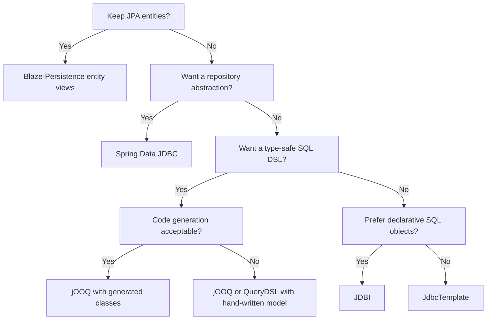

The [Spring Data JPA projections handbook](/posts/jpa-projections) post covers how far we can push JPA projections while staying inside the persistence context.
Sometimes that context is exactly what we want to avoid. We do not always need a session, an identity map, proxy objects, dirty checking or entity graphs deciding when a query runs.
Sometimes we want to work plain SQL that maps straight into records and nothing else.

This post tours six alternatives:

- [Spring Data JDBC](https://docs.spring.io/spring-data/relational/reference/jdbc.html)
- [JdbcTemplate](https://docs.spring.io/spring-framework/docs/current/javadoc-api/org/springframework/jdbc/core/JdbcTemplate.html)
- [JDBI](https://jdbi.org/)
- [jOOQ](https://www.jooq.org/doc/3.22/manual/)
- [QueryDSL SQL](https://openfeign.github.io/querydsl/tutorials/sql/)
- [Blaze-Persistence](https://persistence.blazebit.com/documentation/1.6/entity-view/manual/en_US/index.html)

## The model

Every project uses the same data model.
`movies` and `actors` hold the data, and `movies_actors` is the many-to-many join table:

```sql
CREATE TABLE IF NOT EXISTS movies (
    id BIGINT GENERATED BY DEFAULT AS IDENTITY PRIMARY KEY,
    title VARCHAR(255) NOT NULL,
    release_year INT NOT NULL,
    genre VARCHAR(100) NOT NULL
);

CREATE TABLE IF NOT EXISTS actors (
    id BIGINT GENERATED BY DEFAULT AS IDENTITY PRIMARY KEY,
    first_name VARCHAR(255) NOT NULL,
    last_name VARCHAR(255) NOT NULL
);

CREATE TABLE IF NOT EXISTS movies_actors (
    movie_id BIGINT NOT NULL,
    actor_id BIGINT NOT NULL,
    PRIMARY KEY (movie_id, actor_id),
    FOREIGN KEY (movie_id) REFERENCES movies(id),
    FOREIGN KEY (actor_id) REFERENCES actors(id)
);
```

The read models are three records. They are identical in every project, apart from Blaze-Persistence, where two of them are entity views instead:

```java
public record MovieTitleDto(Long id, String title, int releaseYear, String genre) {}

public record MovieWithActorsDto(Long id, String title, int releaseYear, String genre, List<ActorDto> actors) {
    public record ActorDto(Long id, String firstName, String lastName) {}
}

public record GenreStatDto(String genre, long movieCount) {}
```

Those records back four queries:

- Lightweight projection: one movie by id, selecting only `id`, `title`, `release_year` and `genre`.
- Full view: one movie plus its actors as a nested list.
- Dynamic search: movies filtered by an optional genre and an optional release year, where either filter can be absent.
- Aggregation: the number of movies per genre, using `GROUP BY genre`.

## Spring Data JDBC

Spring Data JDBC keeps the repository programming model of Spring Data but drops the persistence context. There is no first-level cache, no dirty checking and no lazy loading.
An aggregate is loaded as a whole or not at all, which makes the mapping simpler to reason about.

The `CrudRepository` handles the entity, and the projections are raw SQL behind `@Query`:

```java
public interface MovieRepository extends CrudRepository<Movie, Long> {

    @Query("SELECT id, title, release_year, genre FROM movies WHERE id = :id")
    MovieTitleDto findTitleById(@Param("id") Long id);

    @Query("SELECT id, title, release_year, genre FROM movies WHERE (:genre IS NULL OR genre = :genre) AND (:year IS NULL OR release_year = :year)")
    List<MovieTitleDto> findByGenreAndYear(@Param("genre") String genre, @Param("year") Integer year);

    @Query("SELECT genre, COUNT(*) as movie_count FROM movies GROUP BY genre")
    List<GenreStatDto> findGenreStats();
}
```

The aggregate root is a record too and Spring Data maps columns to constructor parameters by name:

```java
@Table("movies")
public record Movie(@Id Long id, String title, int releaseYear, String genre) {
}
```

Because there is no lazy loading, the nested actors cannot be fetched by navigating a collection after the fact. The service runs a second query and assembles the result:

```java
public MovieWithActorsDto getWithActors(Long id) {
    MovieTitleDto movie = repository.findTitleById(id);
    if (movie == null) {
        return null;
    }
    List<MovieWithActorsDto.ActorDto> actors = repository.findActorsByMovieId(id);
    return new MovieWithActorsDto(movie.id(), movie.title(), movie.releaseYear(), movie.genre(), actors);
}
```

**What is nice**: we keep the Spring Data repository conventions (derived queries, pagination, `CrudRepository` methods) without Hibernate underneath. Records map by constructor, so a projection is just a record and a SQL statement. There is no proxy indirection when we read the result.

**What hurts**: two-query assembly is manual, and because aggregates load as a unit, we cannot treat a collection as a lazy association. Column name mapping still depends on the naming strategy (`release_year` to `releaseYear`) and `@Query` SQL is a string with no compile-time checking.

**When to use**: read-heavy services that want Spring Data ergonomics but have no use for a JPA persistence context.

## JdbcTemplate

If Spring Data JDBC is Spring Data without JPA, `NamedParameterJdbcTemplate` is the bare metal.
We write every query, every row mapping and every nested assembly by hand.

The lightweight projection goes through a hand-written `RowMapper`:

```java
public MovieTitleDto findTitleById(Long id) {
    return jdbcTemplate.queryForObject(
            SELECT_MOVIES + " WHERE id = :id",
            new MapSqlParameterSource("id", id),
            movieTitleMapper
    );
}
```

```java
public class MovieTitleMapper implements RowMapper<MovieTitleDto> {
    @Override
    public MovieTitleDto mapRow(ResultSet rs, int rowNum) throws SQLException {
        return new MovieTitleDto(
                rs.getLong("id"),
                rs.getString("title"),
                rs.getInt("release_year"),
                rs.getString("genre")
        );
    }
}
```

The dynamic search builds its `WHERE` clause from the filters that are present:

```java
List<String> conditions = new ArrayList<>();
MapSqlParameterSource params = new MapSqlParameterSource();

if (genre != null) {
    conditions.add("genre = :genre");
    params.addValue("genre", genre);
}
if (year != null) {
    conditions.add("release_year = :year");
    params.addValue("year", year);
}

String sql = SELECT_MOVIES;
if (!conditions.isEmpty()) {
    sql = "%s WHERE %s".formatted(SELECT_MOVIES, String.join(" AND ", conditions));
}

return jdbcTemplate.query(sql, params, movieTitleMapper);
```

For the full view, a single `ResultSetExtractor` walks the joined rows and folds the actors into one movie:

```java
ResultSetExtractor<MovieWithActorsDto> extractor = rs -> {
    MovieWithActorsDto movie = null;
    List<MovieWithActorsDto.ActorDto> actors = new ArrayList<>();
    while (rs.next()) {
        if (movie == null) {
            movie = new MovieWithActorsDto(
                    rs.getLong("id"),
                    rs.getString("title"),
                    rs.getInt("release_year"),
                    rs.getString("genre"),
                    actors
            );
        }
        long actorId = rs.getLong("actor_id");
        if (!rs.wasNull()) {
            actors.add(new MovieWithActorsDto.ActorDto(
                    actorId,
                    rs.getString("first_name"),
                    rs.getString("last_name")
            ));
        }
    }
    return movie;
};
```

**What is nice**: total control. Any SQL feature works, including database-specific syntax, window functions and CTEs. There is no mapping framework to learn and no hidden query rewriting. For one-off reports or legacy schemas, that directness is a virtue.

**What hurts**: every DTO needs a mapper, dynamic SQL is string assembly, and nested results need a hand-written extractor. Nothing is checked at compile time, and a renamed column breaks at runtime.

**When to use**: ad-hoc reporting, legacy databases or any place where the SQL is genuinely unusual and a framework would only get in the way.

## JDBI

JDBI sits between raw JDBC and a full ORM. It is SQL-first with no persistence context and no entity lifecycle. The demo shows both of its programming styles side by side: the declarative SQL object API and the fluent API.

The SQL object API is an interface with annotated queries.
`@RegisterConstructorMapper` tells JDBI to map rows through the record constructor:

```java
@JdbiRepository
@RegisterConstructorMapper(MovieTitleDto.class)
public interface MovieSqlObject {

    @SqlQuery("SELECT id, title, release_year, genre FROM movies WHERE id = :id")
    MovieTitleDto findTitleById(@Bind("id") Long id);

    @SqlQuery("SELECT id, title, release_year, genre FROM movies WHERE (:genre IS NULL OR genre = :genre) AND (:year IS NULL OR release_year = :year)")
    List<MovieTitleDto> findByGenreAndYear(@Bind("genre") String genre, @Bind("year") Integer year);

    @SqlQuery("SELECT genre, COUNT(*) as movie_count FROM movies GROUP BY genre")
    @RegisterConstructorMapper(GenreStatDto.class)
    List<GenreStatDto> findGenreStats();
}
```

The fluent API does the same work with an explicit handle, which is convenient when the query is built at runtime:

```java
public MovieTitleDto findTitleById(Long id) {
    return jdbi.withHandle(handle ->
            handle.createQuery(SELECT_MOVIES + " WHERE id = :id")
                    .bind("id", id)
                    .mapTo(MovieTitleDto.class)
                    .one()
    );
}
```

JDBI does not scan for mappers by itself. The `Jdbi` bean registers the ones the demo needs, including a hand-written mapper and constructor mappers for the nested and aggregate records:

```java
@Bean
public Jdbi jdbi(DataSource dataSource) {
    return Jdbi.create(dataSource)
            .installPlugin(new SqlObjectPlugin())
            .installPlugin(new PostgresPlugin())
            .registerRowMapper(new MovieRowMapper())
            .registerRowMapper(ConstructorMapper.factory(GenreStatDto.class))
            .registerRowMapper(ConstructorMapper.factory(MovieWithActorsDto.ActorDto.class));
}
```

The demo uses JDBI 3.47.0. The `jdbi3-spring` integration supplies `@JdbiRepository` and `@EnableJdbiRepositories`, so the SQL objects become Spring beans like any other repository.

**What is nice**: the SQL object API feels like MyBatis without XML and constructor mappers remove most of the row-mapping code. The fluent API is always available for the cases the declarative style does not cover. There is no entity layer unless we want one.

**What hurts**: it is another dependency and another integration with Spring. Mapper registration is explicit, so a new DTO does not map until we register it. As with every SQL-first library here, the query strings are not checked at compile time.

**When to use**: teams that like SQL objects and want a lighter alternative to an ORM, with a fluent escape hatch for dynamic queries.

## jOOQ

jOOQ is a type-safe SQL DSL. The usual workflow generates Java from the schema, emits tables, fields and records, and then we write queries against them.
The demo ships two variants of that idea. The first is self-contained and skips code generation: the tables and columns are declared by hand as `Table<?>` and `Field<?>` constants.

```java
private static final Table<?> MOVIES = table("movies");
private static final Field<Long> MOVIE_ID = field("movies.id", Long.class);
private static final Field<String> MOVIE_TITLE = field("movies.title", String.class);
private static final Field<Integer> MOVIE_RELEASE_YEAR = field("movies.release_year", Integer.class);
private static final Field<String> MOVIE_GENRE = field("movies.genre", String.class);
```

A projection selects the columns, aliases them to the record component names, and maps the row straight into the DTO:

```java
public MovieTitleDto findTitleById(Long id) {
    return dsl.select(
                    MOVIE_ID.as("id"),
                    MOVIE_TITLE.as("title"),
                    MOVIE_RELEASE_YEAR.as("releaseYear"),
                    MOVIE_GENRE.as("genre"))
            .from(MOVIES)
            .where(MOVIE_ID.eq(id))
            .fetchOneInto(MovieTitleDto.class);
}
```

Hand-declared fields keep the project self-contained, but they give up part of the type safety that makes jOOQ attractive: we are trusting string column names in the declarations rather than the compiler.

### jOOQ with code generation

The second variant is the real-world setup. `jooq-codegen-maven` with `jooq-meta-extensions` generates the schema classes at build time, and `DDLDatabase` parses `../schema.sql` directly, so the build needs no live database:

```xml
<plugin>
    <groupId>org.jooq</groupId>
    <artifactId>jooq-codegen-maven</artifactId>
    <version>${jooq.version}</version>
    <executions>
        <execution>
            <id>generate-jooq-sources</id>
            <phase>generate-sources</phase>
            <goals><goal>generate</goal></goals>
        </execution>
    </executions>
    <configuration>
        <generator>
            <database>
                <name>org.jooq.meta.extensions.ddl.DDLDatabase</name>
                <properties>
                    <property><key>dialect</key><value>POSTGRES</value></property>
                    <property><key>defaultNameCase</key><value>lower</value></property>
                    <property><key>scripts</key><value>../schema.sql</value></property>
                </properties>
            </database>
            <target>
                <packageName>com.hogwai.jooqcodegenprojections.generated</packageName>
                <directory>target/generated-sources/jooq</directory>
            </target>
        </generator>
    </configuration>
</plugin>
```

The `defaultNameCase=lower` property is required: without it jOOQ emits quoted uppercase identifiers like `"MOVIES"` and PostgreSQL fails with `relation "MOVIES" does not exist`.

The generated classes live in `com.hogwai.jooqcodegenprojections.generated.tables`: `Movies` (`Movies.MOVIES`) with fields `MOVIES.ID`, `MOVIES.TITLE`, `MOVIES.RELEASE_YEAR` and `MOVIES.GENRE`, plus `Actors` and `MoviesActors`. The repository keeps the same four operations and the same alias-to-DTO mapping:

```java
public static final String ID = "id";
public static final String TITLE = "title";
public static final String RELEASE_YEAR = "releaseYear";
public static final String GENRE = "genre";

public MovieTitleDto findTitleById(Long id) {
    return dsl.select(
                    MOVIES.ID.as(ID),
                    MOVIES.TITLE.as(TITLE),
                    MOVIES.RELEASE_YEAR.as(RELEASE_YEAR),
                    MOVIES.GENRE.as(GENRE))
            .from(MOVIES)
            .where(MOVIES.ID.eq(id))
            .fetchOneInto(MovieTitleDto.class);
}
```

**What is nice**: whichever model we pick, queries read like SQL and compose well. Aliasing a column to a record component is enough to map it, and `fetchOneInto` and `fetchInto` remove the row-mapper layer entirely. Dynamic filter lists are natural, and code generation turns the schema into compiler-checked tables and fields.

**What hurts**: code generation is the real-world setup, so it adds a build-time step and requires regeneration on every schema change. The hand-written variant avoids that step, but its schema model is maintained by hand and only weakly checked by the compiler.

**When to use**: SQL-heavy services that want a real DSL. The generated variant is what most projects should run while the hand-written model suits builds where a codegen step is not welcome.

## QueryDSL SQL

QueryDSL SQL takes a similar typed-DSL approach built around `RelationalPathBase` classes and constructor expressions.
The demo again ships two variants: hand-written Q-classes and generated ones.

The hand-written variant declares `QMovie` explicitly, including the column metadata used for query rendering:

```java
public class QMovie extends RelationalPathBase<QMovie> {
    public static final QMovie movie = new QMovie("movies");
    public final NumberPath<Long> id = createNumber("id", Long.class);
    public final StringPath title = createString("title");
    public final NumberPath<Integer> releaseYear = createNumber("releaseYear", Integer.class);
    public final StringPath genre = createString("genre");
    // constructor calls addMetadata(...) for each path
}
```

Projections are `ConstructorExpression` objects built with `Projections.constructor`, which binds typed paths to a DTO constructor, and the query is a fluent chain:

```java
public static final ConstructorExpression<MovieTitleDto> MOVIE_TITLE_PROJECTION =
        Projections.constructor(MovieTitleDto.class, movie.id, movie.title, movie.releaseYear, movie.genre);

public MovieTitleDto findTitleById(Long id) {
    return queryFactory
            .select(MOVIE_TITLE_PROJECTION)
            .from(movie)
            .where(movie.id.eq(id))
            .fetchOne();
}
```

### QueryDSL SQL with code generation

The generated variant uses the QueryDSL Maven plugin from the OpenFeign fork. The fork has no `generate` goal; its goals are compile, export, generic-export, jpa-export and test-export, so the demo uses `export`, bound to `generate-sources`:

```xml
<plugin>
    <groupId>io.github.openfeign.querydsl</groupId>
    <artifactId>querydsl-maven-plugin</artifactId>
    <version>${openfeign-querydsl.version}</version>
    <executions>
        <execution>
            <id>querydsl-export</id>
            <phase>generate-sources</phase>
            <goals><goal>export</goal></goals>
            <configuration>
                <jdbcDriver>org.h2.Driver</jdbcDriver>
                <jdbcUrl>jdbc:h2:mem:codegen;MODE=PostgreSQL;DB_CLOSE_DELAY=-1;INIT=RUNSCRIPT FROM 'file:../schema.sql'</jdbcUrl>
                <packageName>com.hogwai.querydslcodegenprojections.generated</packageName>
                <schemaPattern>PUBLIC</schemaPattern>
                <exportTables>true</exportTables>
                <exportViews>false</exportViews>
            </configuration>
        </execution>
    </executions>
    <dependencies>
        <dependency>
            <groupId>com.h2database</groupId>
            <artifactId>h2</artifactId>
            <version>${h2.version}</version>
        </dependency>
    </dependencies>
</plugin>
```

The plugin reads JDBC metadata from an in-memory H2 database in PostgreSQL mode, and `INIT=RUNSCRIPT` loads the shared `../schema.sql`, so the build needs no external database. `schemaPattern=PUBLIC` keeps `INFORMATION_SCHEMA` out of the generated set. The Q-classes land in `com.hogwai.querydslcodegenprojections.generated`, and `build-helper-maven-plugin` adds the output to the source roots. The plugin's default naming does not singularize, so the table names keep their plural form: `QMovies`, `QActors` and `QMoviesActors`.

The repository now uses the generated `QMovies` and `QActors` with `Projections.constructor`:

```java
public static final ConstructorExpression<MovieTitleDto> MOVIE_TITLE_PROJECTION =
        Projections.constructor(MovieTitleDto.class, movies.id, movies.title, movies.releaseYear, movies.genre);

public MovieTitleDto findTitleById(Long id) {
    return queryFactory
            .select(MOVIE_TITLE_PROJECTION)
            .from(movies)
            .where(movies.id.eq(id))
            .fetchOne();
}
```

The `SQLQueryFactory` is created from PostgreSQL templates and a Spring-aware connection provider and exception translator:

```java
@Bean
public SQLQueryFactory queryFactory(DataSource dataSource) {
    SQLTemplates templates = new PostgreSQLTemplates();
    Configuration configuration = new Configuration(templates);
    configuration.setExceptionTranslator(new SpringExceptionTranslator());

    return new SQLQueryFactory(configuration, new SpringConnectionProvider(dataSource));
}
```

The demo uses the [OpenFeign fork of QueryDSL 7.1](https://github.com/OpenFeign/querydsl) rather than the original [querydsl](https://github.com/querydsl/querydsl) artifacts.

**What is nice**: the typed paths make joins and predicates readable, and `Projections.constructor` maps straight into records. Two-query assembly for the nested actors looks exactly like the jOOQ version with typed joins instead of string fields. Code generation derives the paths and column metadata from the schema instead of asking us to write them.

**What hurts**: we need Q-classes. Generated Q-classes are the normal path and add a build plugin, while the hand-written variant removes the build step but means the compiler no longer checks the schema for us. Dynamic queries mutate the builder, which is workable but less tidy than jOOQ's filter list. And the fork situation is a real adoption question.

**When to use**: projects already invested in QueryDSL or teams that prefer constructor expressions and typed paths. Run the generated variant unless a build plugin is a problem.

## Blaze-Persistence

Blaze-Persistence is the one option here that keeps JPA. It adds entity views, an interface layer over real entities, and fetches only the mapped attributes. If we already have a JPA model and do not want to migrate away from it, this is the path that stays put.

An entity view is an interface annotated with `@EntityView`. It looks like a JPA projection but it runs on top of the entity model and can fetch nested associations in one query:

```java
@EntityView(Movie.class)
public interface MovieTitleView {

    @IdMapping
    Long getId();

    String getTitle();

    int getReleaseYear();

    String getGenre();
}
```

The nested version maps the actors collection as another entity view:

```java
@EntityView(Movie.class)
public interface MovieWithActorsView {

    @IdMapping
    Long getId();

    String getTitle();

    int getReleaseYear();

    String getGenre();

    Set<ActorView> getActors();

    @EntityView(Actor.class)
    interface ActorView {

        @IdMapping
        Long getId();

        String getFirstName();

        String getLastName();
    }
}
```

Loading is done through the `EntityViewManager`:

```java
public MovieTitleView findTitleById(Long id) {
    return entityViewManager.find(entityManager, MovieTitleView.class, id);
}
```

Dynamic filters use the Blaze `CriteriaBuilder` together with an `EntityViewSetting` that applies the view to the query:

```java
public List<MovieTitleView> findByGenreAndYear(String genre, Integer year) {
    CriteriaBuilder<Movie> criteriaBuilder = criteriaBuilderFactory.create(entityManager, Movie.class);

    if (genre != null) {
        criteriaBuilder.where("genre").eq(genre);
    }
    if (year != null) {
        criteriaBuilder.where("releaseYear").eq(year);
    }

    CriteriaBuilder<MovieTitleView> viewCriteriaBuilder = entityViewManager.applySetting(
            EntityViewSetting.create(MovieTitleView.class),
            criteriaBuilder
    );
    return viewCriteriaBuilder.getResultList();
}
```

The integration is wired with a configuration class and `@EnableEntityViews` which scans the view package.

The aggregate query is the exception: it stays a plain JPQL constructor expression through the `EntityManager`, because counting per genre does not fit the entity view shape:

```java
return entityManager.createQuery(
                """
                SELECT new com.hogwai.blazeprojections.dto.GenreStatDto(m.genre, COUNT(m.id))
                FROM Movie m
                GROUP BY m.genre
                ORDER BY m.genre
                """,
        GenreStatDto.class
).getResultList();
```

The demo uses Blaze-Persistence 1.6.20.

**What is nice**: we keep our entities and our existing JPA setup. Entity views declare exactly which attributes to fetch, nested associations can be fetched without N+1 by design, and there is Spring Data integration for repository-style usage. Dynamic filtering reuses the JPA criteria API we may already know.

**What hurts**: it is an extra abstraction and an extra integration layer. We have to match Blaze-Persistence versions to our Hibernate, Spring Data, and Spring versions and the demo pins specific integrations for that reason. Entities still exist and still need managing. Aggregations and anything outside the view shape fall back to JPQL.

**When to use**: existing JPA applications that want projection control without leaving the entity model, particularly when nested fetches are the main pain point.

## Choosing between them

The table below summarises the trade-offs. Type safety depends on the variant: both jOOQ and QueryDSL SQL ship in two demo variants, a hand-written schema model, which reads medium, and a generated one, which reads high.

| Library           | Type safety       | Mapping boilerplate | Dynamic queries           | Requires entities | Setup friction |
| ----------------- | ----------------- | ------------------- | ------------------------- | ----------------- | -------------- |
| Spring Data JDBC  | Medium            | Low                 | Good, nullable parameters | Aggregate only    | Low            |
| JdbcTemplate      | Low               | High                | Manual string assembly    | No                | Lowest         |
| JDBI              | Medium            | Low                 | Good, fluent fallback     | No                | Low            |
| jOOQ              | High with codegen | Low                 | Good, condition list      | No                | Medium         |
| QueryDSL SQL      | High with codegen | Low                 | Good, builder mutation    | No                | Medium         |
| Blaze-Persistence | High              | Low                 | Good, criteria API        | Yes               | High           |

A rough decision flow:



## References

- [Spring Data JDBC reference](https://docs.spring.io/spring-data/relational/reference/jdbc.html)
- [JdbcTemplate and NamedParameterJdbcTemplate](https://docs.spring.io/spring-framework/reference/data-access/jdbc/core.html)
- [JDBI documentation](https://jdbi.org/)
- [jOOQ manual](https://www.jooq.org/doc/latest/manual/)
- [QueryDSL reference](https://openfeign.github.io/querydsl/)
- [OpenFeign QueryDSL fork](https://github.com/OpenFeign/querydsl)
- [Blaze-Persistence entity views](https://persistence.blazebit.com/documentation/1.6/entity-view/manual/en_US/)

The complete source code for this article is available at
[alternative-projections](https://github.com/Hogwai/hogwai.github.io-content/tree/main/alternative-projections).
