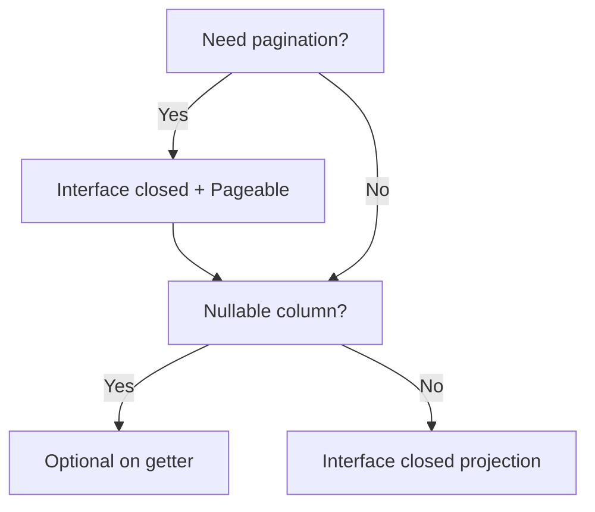
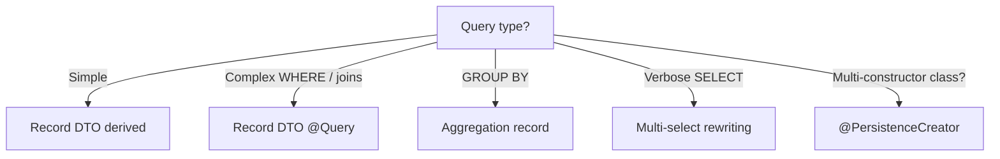
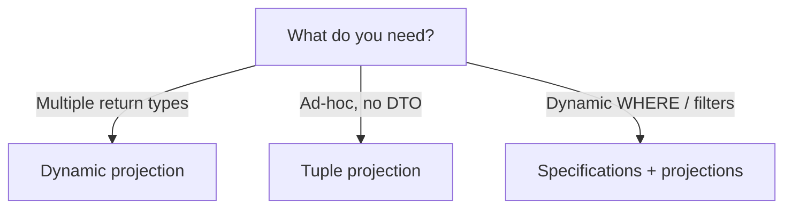
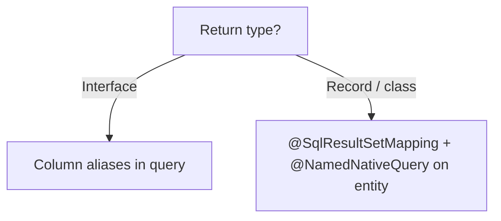
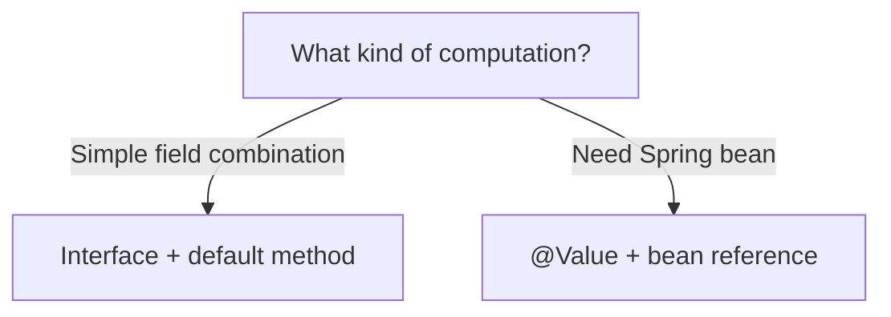
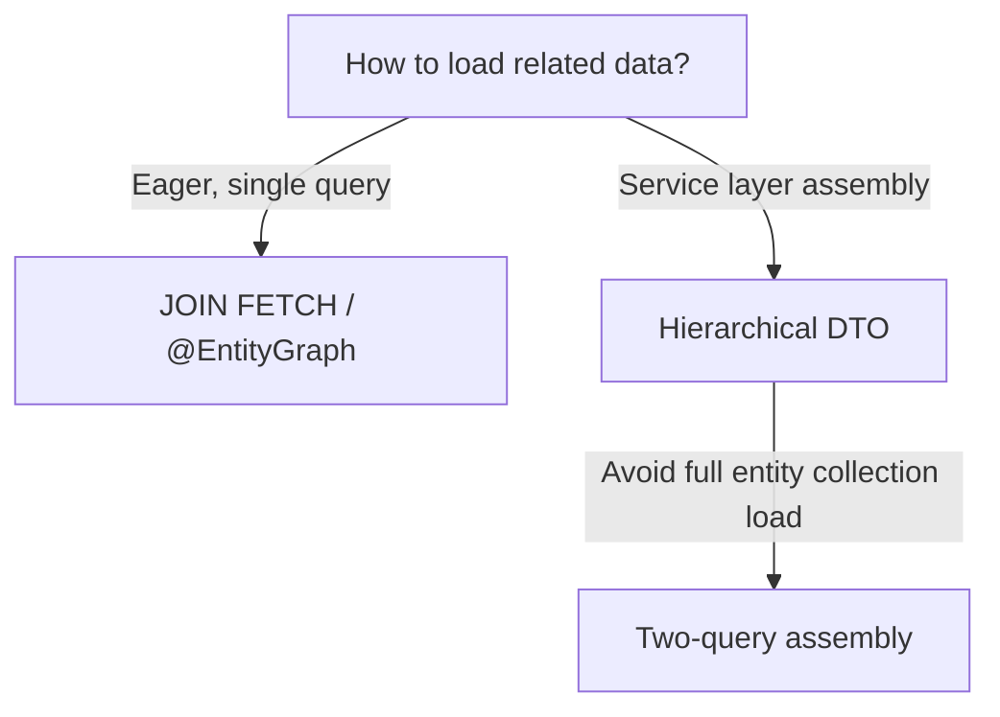

## The problem

Consider a REST endpoint that returns movie titles by genre:

```json
GET /api/movies?genre=Sci-Fi
[{"id": 1, "title": "The Matrix"}, {"id": 2, "title": "Inception"}]
```

Here are the entities behind this endpoint. `Movie` has an id, title, release year, genre, and a many-to-many relationship to `Actor` through a join table `movies_actors`:

```java
@Entity
@Table(name = "movies")
public class Movie {
    @Id @GeneratedValue(strategy = GenerationType.IDENTITY)
    private Long id;

    @Column(nullable = false)
    private String title;

    @Column(name = "release_year", nullable = false)
    private int releaseYear;

    @Column(nullable = false)
    private String genre;

    @ManyToMany(fetch = FetchType.LAZY)
    @JoinTable(name = "movies_actors",
        joinColumns = @JoinColumn(name = "movie_id"),
        inverseJoinColumns = @JoinColumn(name = "actor_id"))
    private Set<Actor> actors = new HashSet<>();
}
```

```java
@Entity
@Table(name = "actors")
public class Actor {
    @Id @GeneratedValue(strategy = GenerationType.IDENTITY)
    private Long id;

    @Column(name = "first_name", nullable = false)
    private String firstName;

    @Column(name = "last_name", nullable = false)
    private String lastName;

    @ManyToMany(mappedBy = "actors", fetch = FetchType.LAZY)
    private Set<Movie> movies = new HashSet<>();
}
```

A naive JPA approach loads the full `Movie` entity for the query: all four mapped columns (id, title, release_year, genre), attached to the persistence context, tracked for dirty changes, with snapshot maintenance. That overhead exists even though the data is only serialised to JSON and sent over the wire.

With nested collections, the problem compounds. Returning movies with their actors without explicit fetch instructions triggers N+1 queries: one for the movies, then one per movie to load the actors from the join table.

Projections solve this by limiting the `SELECT` to only what the caller needs.

## What is a projection?

A projection limits the columns a query returns to only what the consumer needs. Instead of loading a full entity, a projection fetches a subset of columns into a lightweight read-only structure.

**Benefits**:

- **Less data over the wire**: narrower SQL `SELECT` means fewer bytes from database to application
- **No persistence context overhead**: projections are not attached to the `EntityManager`, so there is no dirty checking or snapshot maintenance
- **Clear contracts**: a projection type explicitly declares what data a consumer receives

There are two categories:

| Type       | Description                                                        | SELECT optimisation                                         |
| ---------- | ------------------------------------------------------------------ | ----------------------------------------------------------- |
| **Closed** | Every method maps 1:1 to an entity property name                   | Spring Data rewrites the query to select only those columns |
| **Open**   | Uses `@Value` SpEL expressions or otherwise breaks the 1:1 mapping | Full entity loaded, optimisation disabled                   |

## Interface projections

### Interface closed projection

The simplest form: a Java interface with getters matching entity property names.

```java
public interface MovieTitleView {
    Long getId();
    String getTitle();
}
```

```java
List<MovieTitleView> findByGenre(String genre);
```

Spring Data rewrites the SQL to select only `id` and `title`:

```sql
SELECT m.id, m.title FROM movies m WHERE m.genre = ?
```

The result is a dynamic proxy backed by a `Tuple`. No entity is loaded, no persistence context involved.

**When to use**: simple read-only lists where the response is a flat subset of entity columns. Zero boilerplate.

### Pagination with interface closed projection

Same interface, add `Pageable`:

```java
Page<MovieTitleView> findByGenre(String genre, Pageable pageable);
```

Spring Data adds `LIMIT ... OFFSET ...` to the main query and issues a secondary `COUNT` query for total pages.

**When to use**: any endpoint that serves lists to a UI. Always paginate instead of returning unbounded collections.

### Nullable wrappers in interface projections

Interface projections support nullable wrappers: if a database column is nullable, the getter can return `Optional<T>` instead of `T`:

```java
public interface MovieTitleView {
    Long getId();
    String getTitle();
    Optional<String> getGenre();
}
```

Spring Data automatically wraps the column value in an `Optional`, eliminating null checks in consumer code. This works with any column-backed getter in a closed interface projection: the query remains optimised and the SELECT narrows to only the declared accessors.

**When to use**: any nullable column where the consumer should explicitly handle absence.



## Record / class DTO projections

### Record DTO (derived query)

Java Records work natively with Spring Data projections:

```java
public record MovieTitleDto(Long id, String title) {}
```

```java
List<MovieTitleDto> findByTitleContaining(String title);
```

Spring Data detects the Record's canonical constructor and rewrites the query:

```sql
SELECT m.id, m.title FROM movies m WHERE m.title LIKE '%' || ? || '%'
```

**Key advantages over interface projections**:

- **No proxy**: records are plain objects, no method dispatch overhead
- **Immutability**: guaranteed by the language
- **Value semantics**: `equals()`, `hashCode()`, `toString()` auto-generated
- **Serialization-friendly**: Jackson and Spring MVC work with records natively

### Record DTO with explicit `@Query`

For queries that derived method names cannot express (comparison operators, joins):

```java
@Query("""
        SELECT new com.hogwai.jpaprojections.projection.MovieTitleDto(m.id, m.title)
        FROM Movie m
        WHERE m.releaseYear >= :year
        """)
List<MovieTitleDto> findMoviesReleasedAfter(@Param("year") int year);
```

Spring Data also supports automatic rewriting: you can write `SELECT m` and it rewrites to the constructor expression at runtime.

If you use `Page<T>` with an explicit `@Query` that returns a constructor expression, you typically need a `countQuery` parameter — otherwise Spring Data tries to derive a count from the JPQL expression, which can produce wrong SQL with `GROUP BY` or `JOIN FETCH`.

**When to use**: complex WHERE clauses, cross-entity joins, or any query that derived method names cannot handle.

### Multi-select query rewriting

Spring Data can rewrite multi-select JPQL queries to constructor expressions automatically. Instead of writing a full `SELECT new` constructor expression, you can list individual properties in the `SELECT` clause:

```java
@Query("SELECT m.title, m.genre FROM Movie m WHERE m.genre = :genre")
List<MovieTitleGenreDto> findTitleAndGenreByGenre(@Param("genre") String genre);
```

Spring Data detects that the `SELECT` clause lists individual properties and that the return type is a DTO, then rewrites the query:

```java
SELECT new MovieTitleGenreDto(m.title, m.genre) FROM Movie m WHERE m.genre = ?
```

The constructor parameter names must match the selected properties. The `-parameters` compiler flag (enabled by Spring Boot) preserves those names at runtime. This works with both Records and class-based DTOs.

**When to use**: JPQL queries where writing a full constructor expression adds noise to an already complex query.

### `@PersistenceCreator` for multi-constructor DTOs

When a class-based DTO (not a Record) defines more than one constructor, Spring Data cannot determine which one to use for projection. The solution is `@PersistenceCreator`:

```java
public class GenreStatDto {
    private final String genre;
    private final long movieCount;

    protected GenreStatDto() {
        this("unknown", 0);
    }

    @PersistenceCreator
    public GenreStatDto(String genre, long movieCount) {
        this.genre = genre;
        this.movieCount = movieCount;
    }

    public String getGenre() { return genre; }
    public long getMovieCount() { return movieCount; }
}
```

The no-arg constructor exists for other frameworks (like Jackson deserialization) that create instances via reflection with a no-arg constructor. The `@PersistenceCreator` annotation on the parameterized constructor tells Spring Data: _this_ is the constructor to use for projection.

Records dodge this entirely: they have a single canonical constructor by definition, so no ambiguity arises.

**When to use**: legacy codebases with existing POJO DTOs, or when you need both a no-arg constructor and a projection constructor.

### Aggregation with `GROUP BY`

Records work naturally with aggregate queries:

```java
public record GenreStat(String genre, long movieCount) {}
```

```java
@Query("""
        SELECT new com.hogwai.jpaprojections.projection.GenreStat(m.genre, COUNT(m))
        FROM Movie m
        GROUP BY m.genre
        ORDER BY COUNT(m) DESC
        """)
List<GenreStat> countByGenre();
```

```sql
SELECT m.genre, COUNT(m.id) FROM movies m GROUP BY m.genre ORDER BY COUNT(m.id) DESC
```

**When to use**: reports, dashboards, aggregate endpoints.



## Dynamic and runtime projections

### Dynamic projection

One repository method serves multiple consumers:

```java
<T> List<T> findByGenre(String genre, Class<T> type);
```

```java
List<MovieTitleView> views = repo.findByGenre("Sci-Fi", MovieTitleView.class);
List<MovieTitleDto>  dtos  = repo.findByGenre("Sci-Fi", MovieTitleDto.class);
List<Movie>          movies = repo.findByGenre("Sci-Fi", Movie.class);
```

The `Class<T>` parameter routes to the same optimisation logic as static return types, but the decision is deferred to runtime.

**Caveat**: compile-time safety is limited, any `Class` can be passed.

**When to use**: the same query must serve multiple consumers with different data needs.

### Tuple projection

The rawest form, no DTO needed:

```java
@Query("""
        SELECT m.id AS id, m.title AS title,
               m.releaseYear AS releaseYear, m.genre AS genre
        FROM Movie m WHERE m.genre = :genre
        """)
List<Tuple> findTupleByGenre(@Param("genre") String genre);
```

```java
for (Tuple t : results) {
    Long id = t.get("id", Long.class);
    String title = t.get("title", String.class);
}
```

`jakarta.persistence.Tuple` provides typed access by name or position. This is the same mechanism Spring Data uses internally to back interface projections.

**When to use**: ad-hoc queries, dynamic column selection, or prototyping before defining a dedicated projection type.

### Specifications + projections (fluent API)

For dynamic WHERE predicates at runtime:

```java
public class MovieSpecifications {
    public static Specification<Movie> genreEquals(String genre) {
        return (root, query, cb) -> cb.equal(root.get("genre"), genre);
    }
    public static Specification<Movie> releaseYearGreaterOrEqual(int year) {
        return (root, query, cb) -> cb.greaterThanOrEqualTo(root.get("releaseYear"), year);
    }
}
```

```java
Specification<Movie> spec = MovieSpecifications.genreEquals("Sci-Fi")
        .and(MovieSpecifications.releaseYearGreaterOrEqual(2000));

List<MovieTitleDto> results = movieRepository
        .findBy(spec, q -> q.as(MovieTitleDto.class).all());
```

**Caveat**: column narrowing from `.as(Projection.class)` is limited compared to derived query projections. The underlying mechanism loads the entity and then maps to the projection, so you still get the full entity SELECT. Use this for predicate dynamism, not for column optimisation.

**When to use**: search endpoints with dynamic filters, admin panels, or any query where the filter criteria are not known at compile time.



## Native SQL projections

### Native query + interface projection (column aliases)

```java
@Query(value = "SELECT m.id AS id, m.title AS title FROM movies m WHERE m.genre = ?1",
       nativeQuery = true)
List<MovieTitleView> findByGenreNative(String genre);
```

Column aliases must match Java property names (camelCase). Spring Data creates interface proxies from the native result.

**When to use**: database-specific SQL features (window functions, CTEs, `ILIKE`, `FOR UPDATE`) while keeping projection benefits.

### Native query + Record DTO (`@SqlResultSetMapping`)

Native queries with class-based DTOs require a `@SqlResultSetMapping`:

```java
@SqlResultSetMapping(
    name = "MovieTitleDtoMapping",
    classes = @ConstructorResult(
        targetClass = MovieTitleDto.class,
        columns = {
            @ColumnResult(name = "id", type = Long.class),
            @ColumnResult(name = "title")
        }
    )
)
@NamedNativeQuery(
    name = "Movie.findByGenreNativeDto",
    query = "SELECT m.id, m.title FROM movies m WHERE m.genre = ?1",
    resultSetMapping = "MovieTitleDtoMapping"
)
@Entity
public class Movie { ... }
```

```java
@Query(name = "Movie.findByGenreNativeDto", nativeQuery = true)
List<MovieTitleDto> findByGenreNativeDto(String genre);
```

Without this mapping, native queries returning class-based DTOs produce a `ConverterNotFoundException`.

| Aspect               | JPQL (`@Query`)            | Native SQL                      |
| -------------------- | -------------------------- | ------------------------------- |
| Interface projection | Aliases match getter names | Need explicit column aliases    |
| Class/Record DTO     | Auto or `SELECT new`       | Requires `@SqlResultSetMapping` |
| Portability          | Database-agnostic          | Database-specific               |



## Computed fields in projections

### Interface + default method (instead of `@Value` SpEL)

```java
public interface ActorNameView {
    Long getId();
    String getFirstName();
    String getLastName();

    default String getFullName() {
        return getFirstName() + " " + getLastName();
    }
}
```

Why this matters: using `@Value("#{target.firstName + ' ' + target.lastName}")` makes the projection _open_. Spring Data cannot optimise the SELECT because the SpEL expression could reference any property, so the full entity is loaded.

A `default` method keeps the projection _closed_: all accessors still map directly to entity properties, so Spring Data optimises the SELECT. The computation happens in Java on the already-loaded subset.

| Approach         | SELECT optimisation      | Boilerplate |
| ---------------- | ------------------------ | ----------- |
| `@Value` SpEL    | Full entity loaded       | Minimal     |
| `default` method | Narrowed to used columns | Minimal     |

Use `@Value` only when you need to reference a Spring bean (`@Value("#{@myBean.getFullName(target)}")`) or a query method argument.

### `@Value` with bean reference

When you need to call a Spring bean from a projection (for example, to combine a property with translatable text or domain logic), the `@Value` annotation with a SpEL bean reference is the right tool:

```java
@Component("projectionHelper")
public class ProjectionHelper {
    public String formatGenreLabel(Movie movie) {
        return movie.getTitle() + " [" + movie.getGenre() + "]";
    }
}
```

```java
public interface MovieWithLabelView {
    String getTitle();

    @Value("#{@projectionHelper.formatGenreLabel(target)}")
    String getGenreLabel();
}
```

`#target` refers to the underlying entity instance. Because `@Value` breaks the 1:1 property mapping, this is an _open_ projection: Spring Data loads the full entity before evaluating the SpEL expression:

```sql
SELECT m.id, m.title, m.release_year, m.genre FROM movies m WHERE m.genre = ?
```

All entity columns are selected even though only `title` is used individually by the projection.

**When to use**: only when a `default` method cannot provide the logic: specifically when you need access to a Spring bean. For simple computed fields, a `default` method keeps the projection closed.



## Nested collections

### Nested interface projections

Returning movies with their actors requires special handling. Three approaches:

#### JOIN FETCH

```java
public interface MovieWithActorsView {
    Long getId();
    String getTitle();
    int getReleaseYear();
    Set<ActorView> getActors();

    interface ActorView {
        Long getId();
        String getFirstName();
        String getLastName();
    }
}
```

```java
@Query("SELECT m FROM Movie m JOIN FETCH m.actors WHERE m.genre = :genre")
List<MovieWithActorsView> findByGenreWithActors(@Param("genre") String genre);
```

`JOIN FETCH` forces Hibernate to load the actors collection in the same SQL query:

```sql
SELECT m1_0.id, a1_0.movie_id, a1_1.id, a1_1.first_name, a1_1.last_name,
       m1_0.genre, m1_0.release_year, m1_0.title
FROM movies m1_0
JOIN movies_actors a1_0 ON m1_0.id = a1_0.movie_id
JOIN actors a1_1 ON a1_1.id = a1_0.actor_id
WHERE m1_0.genre = ?
```

Limitation: with `@Query("SELECT m ...")` the full `Movie` entity is selected; column narrowing is not applied on the root entity. The nested `ActorView` columns are also fully selected.

#### @EntityGraph

```java
@NamedEntityGraph(
    name = "Movie.withActors",
    attributeNodes = @NamedAttributeNode("actors")
)
@Entity
public class Movie { ... }
```

```java
@EntityGraph("Movie.withActors")
List<MovieWithActorsView> findByGenreIgnoreCase(String genre);
```

`@EntityGraph` is a declarative alternative to `JOIN FETCH`. The named entity graph is defined once and reused across query methods. It works with derived queries (no `@Query` needed).

| Approach       | Pros                                      | Cons                             |
| -------------- | ----------------------------------------- | -------------------------------- |
| `JOIN FETCH`   | Explicit in the query, no entity coupling | Tied to one query string         |
| `@EntityGraph` | Reusable, works with derived queries      | Declared on entity, less visible |

`JOIN FETCH` produces an INNER JOIN; `@EntityGraph` produces a LEFT JOIN. For non-null foreign keys (the common case) the result is the same. Choose `@EntityGraph` when the same fetch strategy applies to multiple queries.

#### N+1 demonstration (unsafe)

```java
@Query("SELECT m FROM Movie m WHERE m.genre = :genre")
List<MovieWithActorsView> findByGenreWithActorsNPlusOne(@Param("genre") String genre);
```

This deliberately omits the fetch. When you access `getActors()` on each result, Hibernate fires one lazy-load query per movie. With 3 Sci-Fi movies: **1 + 3 = 4 queries** instead of 1.

Safe (JOIN FETCH): 1 query
Unsafe (no fetch): 1 + N queries

### Hierarchical DTO (service assembly)

JPQL constructor expressions cannot directly produce nested collection DTOs. The solution is service-level assembly:

```java
public record MovieDetailDto(
    Long id, String title, int releaseYear, String genre,
    List<ActorDto> actors
) {
    public record ActorDto(Long id, String firstName, String lastName) {}
}
```

```java
@Transactional(readOnly = true)
public MovieDetailDto getMovieDetail(Long movieId) {
    Movie movie = movieRepository.findById(movieId).orElse(null);
    if (movie == null) return null;

    List<ActorDto> actorDtos = movie.getActors().stream()
            .map(a -> new ActorDto(a.getId(), a.getFirstName(), a.getLastName()))
            .toList();

    return new MovieDetailDto(
            movie.getId(), movie.getTitle(), movie.getReleaseYear(),
            movie.getGenre(), actorDtos);
}
```

`@Transactional(readOnly = true)` keeps LAZY associations available for the mapping.

#### Two-query assembly alternative

When you want to avoid the N+1 that would come from lazy-loading the movies collection on every entity:

```java
public ActorWithMoviesDto getActorWithMovies(Long actorId) {
    var actor = actorRepository.findById(actorId).orElse(null);
    if (actor == null) return null;

    List<MovieTitleDto> movies = actorRepository.findMoviesByActorId(actorId);
    return new ActorWithMoviesDto(
            actor.getId(), actor.getFirstName(), actor.getLastName(),
            movies);
}
```

Two independent queries: the first loads the full `Actor` entity (no way around it for the root), the second fetches the movies collection as a lightweight projection. The key benefit is avoiding a whole-entity load for the _collection_ side.



## How Spring Data optimises projections

Spring Data uses two strategies depending on the projection type:

1. **Interface projections**: Spring Data generates a dynamic proxy backed by a `Tuple`. The query is rewritten at runtime: only the columns matching interface accessor methods are included in the `SELECT` clause. This works because the interface is _closed_: every method corresponds to a known entity property.

2. **Record/Class projections**: Spring Data inspects the canonical constructor parameter names and matches them to entity properties. For derived queries, the query is automatically rewritten to a `SELECT new ...` JPQL constructor expression. For explicit `@Query` returning a class-based DTO, the same rewriting applies when the JPQL selects the root entity.

The `-parameters` compiler flag is needed for class-based DTOs to preserve constructor parameter names. For Records this is less critical because the JVM preserves component names via `Class.getRecordComponents()`. Spring Boot enables this flag by default in its parent POM.

## Anti-patterns to avoid

| Anti-pattern                                    | Why                                                                            | Instead use                                         |
| ----------------------------------------------- | ------------------------------------------------------------------------------ | --------------------------------------------------- |
| `@Value("#{target.x + target.y}")`              | Open projection: disables SELECT optimisation                                  | `default` method on interface                       |
| Nested interface without `JOIN FETCH`           | N+1 queries for each root entity                                               | `@Query` with `JOIN FETCH` or `@EntityGraph`        |
| Interface projection for batch jobs             | Proxy indirection, allocation overhead from proxy objects, no value semantics  | Record DTO with constructor expression              |
| Native SQL for simple JPQL queries              | Loses query rewriting and portability                                          | JPQL `@Query`                                       |
| Loading full entity for 1-2 fields              | Persistence context overhead, more data over the wire                          | Closed interface or Record projection               |
| Raw type on nullable interface getter           | Nullable column returns `null`, callers must null-check everywhere             | `Optional<T>` return type for nullable columns      |
| Primitive constructor param for nullable column | Database NULL mapped to primitive `long`/`int` throws NPE at construction time | Boxed type `Long`/`Integer` instead                 |
| Class DTO with multiple constructors            | Spring Data cannot determine which constructor to use                          | `@PersistenceCreator` on the projection constructor |
| Whole-entity service assembly in a loop         | N+1 on lazy collections in `findAll()` + stream                                | Batch fetch or two-query assembly                   |

## Projection types summary

| #   | Type                          | Return type                      | Query                      | Use case                     |
| --- | ----------------------------- | -------------------------------- | -------------------------- | ---------------------------- |
| 1   | Interface Closed              | `MovieTitleView`                 | Derived (optimised)        | Flat read-only view          |
| 2   | Interface Closed + pagination | `Page<MovieTitleView>`           | Derived + `Pageable`       | Paginated lists              |
| 3   | Nullable wrappers             | `MovieTitleView` + `Optional<?>` | Derived (optimised)        | Null-safe interface getters  |
| 4   | Interface + JOIN FETCH        | `MovieWithActorsView`            | `@Query`                   | Nested entities              |
| 5   | Interface + @EntityGraph      | `MovieWithActorsView`            | Derived + annotation       | Reusable fetch strategy      |
| 6   | N+1 demo                      | `MovieWithActorsView`            | Without fetch              | Observe N+1 behaviour        |
| 7   | Interface + default method    | `ActorNameView`                  | Derived (optimised)        | Derived fields, no SpEL      |
| 8   | Record DTO (derived)          | `MovieTitleDto`                  | Derived (rewritten)        | Simple DTO                   |
| 9   | Record DTO (@Query)           | `MovieTitleDto`                  | JPQL constructor           | Complex WHERE/joins          |
| 10  | Multi-select rewriting        | `MovieTitleGenreDto`             | Multi-select JPQL          | Concise queries              |
| 11  | `@PersistenceCreator`         | `GenreStatDto`                   | JPQL constructor           | Multi-constructor class DTOs |
| 12  | Aggregation record            | `GenreStat`                      | JPQL `GROUP BY`            | Reports, stats               |
| 13  | Dynamic                       | `<T>`                            | Runtime dispatch           | Multiple consumers           |
| 14  | Native + interface            | `MovieTitleView`                 | Native SQL + aliases       | DB-specific features         |
| 15  | Native + DTO                  | `MovieTitleDto`                  | `@SqlResultSetMapping`     | Native SQL + DTO             |
| 16  | Tuple                         | `Tuple`                          | JPQL with aliases          | Ad-hoc, no DTO               |
| 17  | Specifications                | DTO via `findBy`                 | Fluent + spec              | Dynamic predicates           |
| 18  | `@Value` + bean reference     | `MovieWithLabelView`             | `@Query` (open projection) | Spring bean access           |
| 19  | Hierarchical (service)        | `MovieDetailDto`                 | Entity -> DTO              | Nested collections           |

## Wrapping up

Spring Data JPA projections cover a wide spectrum: from a 3-line interface that narrows the SQL `SELECT`, to service-level assembly for deeply nested responses, to native queries for database-specific features.

The key takeaways:

- **Closed projections** (interface or Record) are the default choice for flat data. They give you SELECT optimisation at zero cost.
- **Default methods** keep projections closed when you need computed fields. Avoid `@Value` SpEL unless you need Spring bean access.
- **Nullable wrappers** (`Optional<T>` on interface getters) make null-safe projections easy with no extra code.
- **Multi-select JPQL** lets Spring Data rewrite `SELECT m.col1, m.col2` into constructor expressions automatically: cleaner than hand-writing every `SELECT new`.
- **`@PersistenceCreator`** resolves constructor ambiguity when a class DTO has more than one constructor. Records avoid this entirely.
- **Nested collections** require explicit `JOIN FETCH` or `@EntityGraph`. Without one, you get N+1 queries.
- **Records** are superior to interfaces for DTOs: no proxy, immutable, value semantics, Jackson-friendly.
- **Dynamic projections** and **Specifications** trade some compile-time safety and column optimisation for runtime flexibility. Reach for them when the query shape is not known in advance.
- **Service assembly** is the only way to produce nested collection DTOs, but you can choose between single-entity load (with `@Transactional`) and two-query projection assembly.

The complete source code for this article is available at
[jpa-projections](https://github.com/Hogwai/hogwai.github.io-content/tree/main/jpa-projections).
