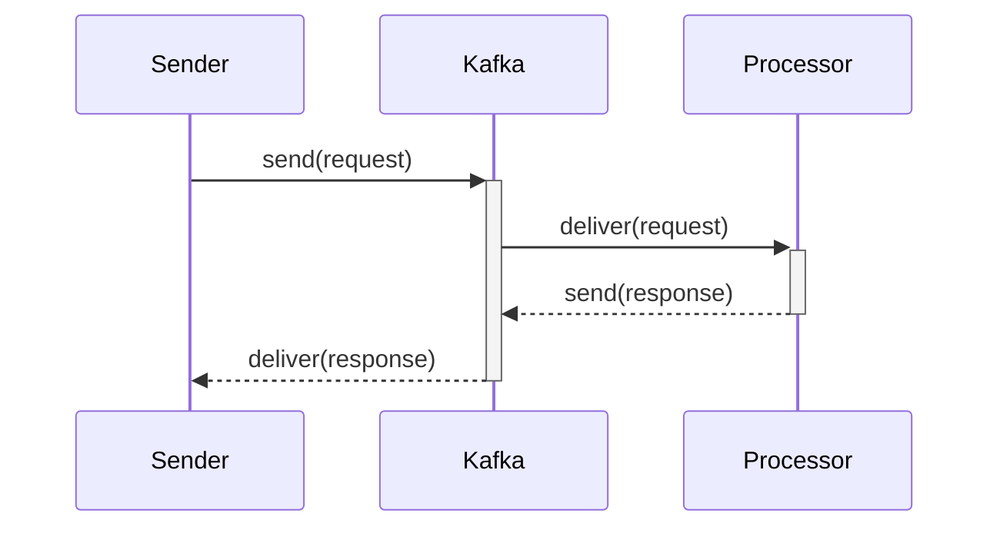
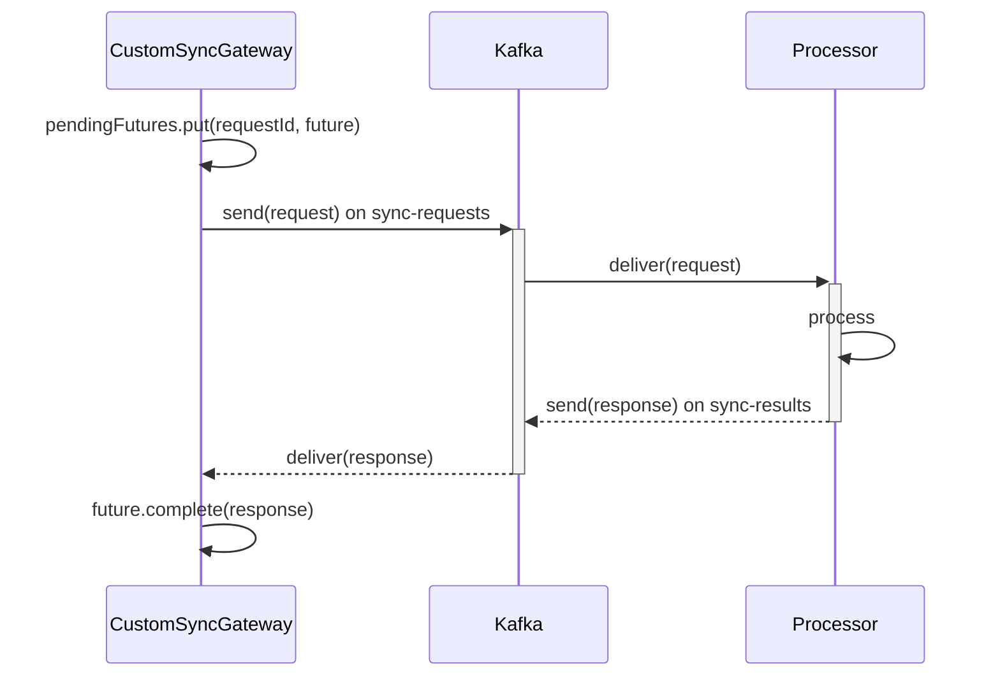
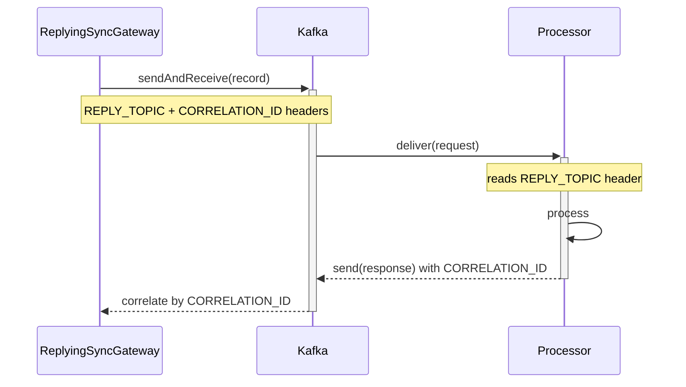

## Some context

Kafka is fundamentally asynchronous. Producers publish messages to topics, consumers read them at their own pace, and no one waits for anyone.

But real-world workflows often break this model. Consider a service that receives a document processing request via REST, needs to hand it off to a remote worker over Kafka, and must block until the result comes back. Or an orchestration engine where step A triggers step B and waits for confirmation before proceeding. Or a legacy system integration where the calling code expects a blocking RPC-style API.

In all these cases, we need synchronous-looking request/reply semantics on top of an asynchronous transport. Kafka itself does not provide this out of the box, Spring Kafka does, through the `ReplyingKafkaTemplate`. Before we look at that, let us understand what it takes to build it manually.

## The problem

A synchronous request/reply has three requirements that Kafka's pub/sub model does not satisfy directly:

- Correlation: When multiple requests are in flight, each response must be matched to the right request. Kafka consumers read from a topic in sequence, a reply consumer sees all responses go by and must know which request each one belongs to.

- Timeout handling: The caller expects an answer within a bounded time. If the remote service is down or slow, the caller must not block indefinitely.

- Concurrent request management: If ten callers each send a request simultaneously, none of their results should be mixed up, and a slow response for one must not block another.

These three problems, correlation, timeout, concurrency, are the ones we need to solve.

## Architecture overview

The setup requires two participants: a sender that initiates the request and a processor that handles it and sends back a response. Both are connected through Kafka topics.

The topics needed are:

- A request topic that carries messages from the sender to the processor
- A response topic (or two, depending on the approach) that carries replies back
- An optional dead letter topic for failed requests

The general flow looks like this:



## The shared model

Both services share two simple records:

```java
public record Request(
    String requestId,
    String payload,
    Instant timestamp
) {
    public Request(String payload) {
        this(UUID.randomUUID().toString(), payload, Instant.now());
    }
}

public record Response(
    String requestId,
    String payload,
    String status,
    long processingTimeMs
) {}
```

The `requestId` is a UUID generated by the sender. It is the key that keeps requests and responses together in both approaches.

## The processor

The processor handles both patterns transparently. It listens on `sync-requests` and checks for the `REPLY_TOPIC` header to decide where to send the reply:

```java
@KafkaListener(
    topics = "${app.kafka.topic.requests}",
    groupId = "request-processor",
    containerFactory = "kafkaListenerContainerFactory"
)
public void onRequest(ConsumerRecord<String, Request> record) {
    Request request = record.value();

    try {
        // business logic
        Response response = new Response(
            request.requestId(),
            "Processed: " + request.payload(),
            "SUCCESS",
            100L
        );
        sendResponse(record, response);
    } catch (Exception e) {
        // Send to DLQ so the message is not lost
        kafkaTemplate.send(dlqTopic, request.requestId(), request);

        // Send a failure response so the sender doesn't time out
        Response errorResponse = new Response(
            request.requestId(),
            e.getMessage(),
            "FAILURE",
            0L
        );
        sendResponse(record, errorResponse);
    }
}

private void sendResponse(ConsumerRecord<String, Request> record, Response response) {
    Header replyTopicHeader = record.headers().lastHeader(KafkaHeaders.REPLY_TOPIC);

    if (replyTopicHeader != null) {
        // ReplyingKafkaTemplate flow, use the header's topic
        String replyTopic = new String(replyTopicHeader.value(), StandardCharsets.UTF_8);
        var reply = new ProducerRecord<>(replyTopic, response.requestId(), response);

        Header correlationId = record.headers().lastHeader(KafkaHeaders.CORRELATION_ID);
        if (correlationId != null) {
            reply.headers().add(correlationId);
        }
        kafkaTemplate.send(reply);
    } else {
        // Custom approach flow, use the fixed results topic
        kafkaTemplate.send(resultsTopic, response.requestId(), response);
    }
}
```

The key insight is the `REPLY_TOPIC` header check. When the request was sent via `ReplyingKafkaTemplate`, the template automatically adds this header (and a `CORRELATION_ID`). When it was sent via the custom approach, no such headers exist, so the processor falls back to the fixed `sync-results` topic.

On failure, the processor sends the original request to a DLQ so it is not lost, and returns a `FAILURE` response immediately. This prevents the sender from timing out and wondering what happened.

## Approach 1: custom with CompletableFuture

The first approach builds the correlation machinery by hand. A `ConcurrentHashMap` stores `CompletableFuture` objects indexed by `requestId`. A separate `@KafkaListener` receives responses and completes the matching future.

```java
@Service
public class CustomSyncGateway {

    private final Map<String, CompletableFuture<Response>> pendingFutures = new ConcurrentHashMap<>();
    private final KafkaTemplate<String, Request> kafkaTemplate;

    public Response sendSync(Request request)
            throws InterruptedException, ExecutionException, TimeoutException {

        var future = new CompletableFuture<Response>();
        pendingFutures.put(request.requestId(), future);

        kafkaTemplate.send(new ProducerRecord<>(requestTopic, request.requestId(), request));

        try {
            return future.get(syncTimeout, TimeUnit.SECONDS);
        } catch (TimeoutException e) {
            pendingFutures.remove(request.requestId());
            throw e;
        }
    }

    public void complete(Response response) {
        var future = pendingFutures.remove(response.requestId());
        if (future != null) {
            future.complete(response);
        }
    }
}
```

Flow:



The response listener resolves the futures:

```java
@Component
public class CustomReplyListener {

    private final CustomSyncGateway gateway;

    @KafkaListener(
        topics = "${app.kafka.topic.results}",
        groupId = "sync-sender-custom",
        containerFactory = "kafkaListenerContainerFactory"
    )
    public void onResponse(ConsumerRecord<String, Response> record) {
        gateway.complete(record.value());
    }
}
```

What you manage manually:

- The `ConcurrentHashMap` to hold pending futures
- Creating and storing the `CompletableFuture` before each send
- Removing the future on timeout to avoid memory leaks
- A dedicated `@KafkaListener` for the reply topic
- Calling `future.complete(response)` when the reply arrives

Pros: Full control. The remote service does not need to know about Kafka headers or Spring-specific correlation mechanisms, it just sends a response to a known topic. Any reply topic shape works.

Cons: Boilerplate. The manual lifecycle is error-prone: a missed cleanup on timeout leaks futures, a race condition in the map access can cause lost responses.

## Approach 2: Spring kafka's ReplyingKafkaTemplate

The second approach uses Spring Kafka's built-in `ReplyingKafkaTemplate`, which handles correlation at the protocol level using Kafka headers.

```java
@Service
public class ReplyingSyncGateway {

    private final ReplyingKafkaTemplate<String, Request, Response> replyingTemplate;

    public Response sendSync(Request request)
            throws InterruptedException, ExecutionException, TimeoutException {

        var record = new ProducerRecord<>(requestTopic, request.requestId(), request);

        RequestReplyFuture<String, Request, Response> future =
                replyingTemplate.sendAndReceive(record, Duration.ofSeconds(syncTimeout));

        var responseRecord = future.get(syncTimeout, TimeUnit.SECONDS);
        return responseRecord.value();
    }
}
```

Flow:



What is handled automatically:

- `REPLY_TOPIC` and `CORRELATION_ID` headers are set on the outgoing record
- A dedicated reply consumer subscribes to the reply topic
- Incoming replies are correlated by the `CORRELATION_ID` header and matched to the right future
- No `ConcurrentHashMap`, no custom `@KafkaListener`, no manual cleanup

Pros: Significantly less code. Header-based correlation is robust, it works as long as the remote service copies the `CORRELATION_ID` header into the reply. Timeout cleanup is automatic.

Cons: Requires the remote service to honor the `REPLY_TOPIC` and `CORRELATION_ID` headers. If you are calling a third-party service that cannot set arbitrary headers on the reply, this approach will not work. The reply topic is also determined by the sender, you must configure it when creating the `ReplyingKafkaTemplate` bean.

## Comparison

| Aspect                     | Custom                          | ReplyingKafkaTemplate                            |
| -------------------------- | ------------------------------- | ------------------------------------------------ |
| Correlation method         | `requestId` in the message body | `CORRELATION_ID` header                          |
| Pending request storage    | `ConcurrentHashMap`             | Internal template state                          |
| Reply listener             | Manual `@KafkaListener`         | Automatic (template-managed)                     |
| Timeout cleanup            | Manual (`finally` block)        | Automatic                                        |
| Boilerplate                | Moderate                        | Minimal                                          |
| Control                    | Full, any reply topic shape     | Template-config constrained                      |
| Remote service requirement | Know which topic to reply to    | Must copy `CORRELATION_ID`/`REPLY_TOPIC` headers |

## When to use which

Use the custom approach when:

- The remote service is not under your control and cannot set framework-specific headers
- You need full control over the reply topic routing
- You are integrating with a legacy system that expects a fixed reply topic

Use ReplyingKafkaTemplate when:

- Both the sender and processor are Spring Boot services under your control
- You prefer less code and framework-native handling
- You want header-based correlation, which is more robust than application-level IDs

## A word of caution

These patterns circumvent Kafka's core design principles. Kafka is built for asynchronous, fire-and-forget messaging at scale. Every synchronous request/reply call holds a thread waiting for a response. If you have hundreds or thousands of concurrent requests, that means hundreds or thousands of threads blocked on futures. This can lead to CPU starvation, thread pool exhaustion, and a Kafka cluster that is spending more time managing reply topics than processing actual work.

Use these patterns sparingly and only where the business logic genuinely requires a synchronous handshake. For most use cases, a fully asynchronous design with event-driven coordination is a better fit for the architecture.

## Conclusion

Whether you choose the manual `CompletableFuture` approach or the framework-native `ReplyingKafkaTemplate` depends on how much control you need versus how much boilerplate you want to avoid. Understanding both gives you the flexibility to make the right trade-off for your use case.

A complete project demonstrating both approaches is available here:
[kafka-synchronous-messaging](https://github.com/Hogwai/hogwai.github.io-content/tree/main/kafka-synchronous-messaging)
