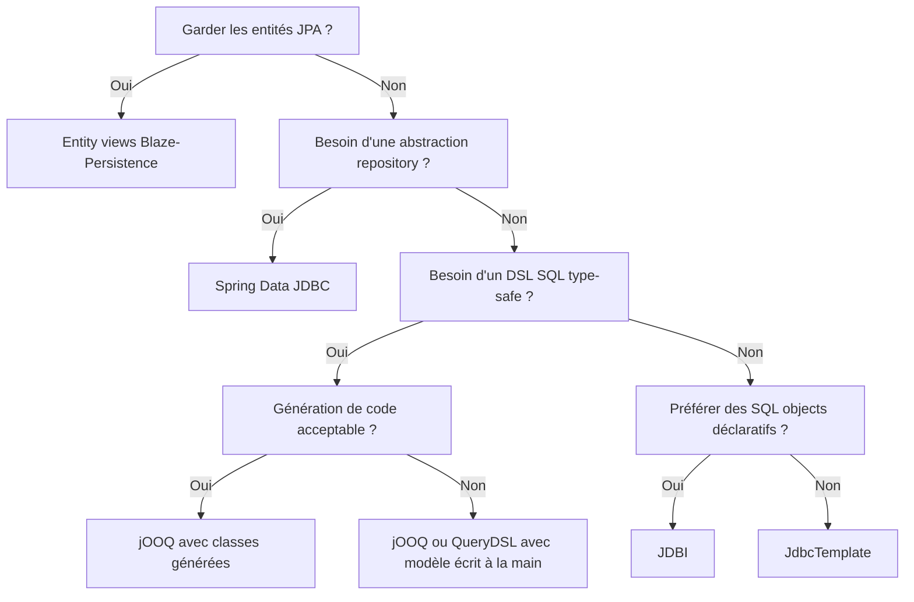

L'article [le guide des projections Spring Data JPA](/fr/posts/jpa-projections) montre jusqu'où pousser les projections JPA en restant dans le contexte de persistance.
Parfois, ce contexte est exactement ce que nous voulons éviter. Nous n'avons pas toujours besoin d'une session, d'une identity map, d'objets proxy, du dirty checking ou d'entity graphs qui décident quand une requête s'exécute.
Parfois, nous voulons écrire du SQL brut qui se mappe directement vers des records, et rien d'autre.

Cet article passe en revue six alternatives :

- [Spring Data JDBC](https://docs.spring.io/spring-data/relational/reference/jdbc.html)
- [JdbcTemplate](https://docs.spring.io/spring-framework/docs/current/javadoc-api/org/springframework/jdbc/core/JdbcTemplate.html)
- [JDBI](https://jdbi.org/)
- [jOOQ](https://www.jooq.org/doc/3.22/manual/)
- [QueryDSL SQL](https://openfeign.github.io/querydsl/tutorials/sql/)
- [Blaze-Persistence](https://persistence.blazebit.com/documentation/1.6/entity-view/manual/en_US/index.html)

## Le modèle

Chaque projet utilise le même modèle de données.
`movies` et `actors` portent les données, et `movies_actors` est la table de jointure many-to-many :

```sql
CREATE TABLE IF NOT EXISTS movies (
    id BIGINT GENERATED BY DEFAULT AS IDENTITY PRIMARY KEY,
    title VARCHAR(255) NOT NULL,
    release_year INT NOT NULL,
    genre VARCHAR(100) NOT NULL
);

CREATE TABLE IF NOT EXISTS actors (
    id BIGINT GENERATED BY DEFAULT AS IDENTITY PRIMARY KEY,
    first_name VARCHAR(255) NOT NULL,
    last_name VARCHAR(255) NOT NULL
);

CREATE TABLE IF NOT EXISTS movies_actors (
    movie_id BIGINT NOT NULL,
    actor_id BIGINT NOT NULL,
    PRIMARY KEY (movie_id, actor_id),
    FOREIGN KEY (movie_id) REFERENCES movies(id),
    FOREIGN KEY (actor_id) REFERENCES actors(id)
);
```

Les modèles de lecture sont trois records. Ils sont identiques dans chaque projet, sauf avec Blaze-Persistence, où deux d'entre eux sont des entity views :

```java
public record MovieTitleDto(Long id, String title, int releaseYear, String genre) {}

public record MovieWithActorsDto(Long id, String title, int releaseYear, String genre, List<ActorDto> actors) {
    public record ActorDto(Long id, String firstName, String lastName) {}
}

public record GenreStatDto(String genre, long movieCount) {}
```

Ces records portent quatre requêtes :

- Projection légère : un film par id, en sélectionnant uniquement `id`, `title`, `release_year` et `genre`.
- Vue complète : un film avec ses acteurs sous forme de liste imbriquée.
- Recherche dynamique : films filtrés par un genre optionnel et une année de sortie optionnelle, où l'un ou l'autre filtre peut être absent.
- Agrégation : le nombre de films par genre, avec `GROUP BY genre`.

## Spring Data JDBC

Spring Data JDBC conserve le modèle de programmation par repository de Spring Data mais abandonne le contexte de persistance. Il n'y a pas de cache de premier niveau, pas de dirty checking et pas de lazy loading.
Un agrégat est chargé en entier ou pas du tout, ce qui rend le mapping plus simple à appréhender.

Le `CrudRepository` gère l'entité, et les projections sont du SQL brut derrière `@Query` :

```java
public interface MovieRepository extends CrudRepository<Movie, Long> {

    @Query("SELECT id, title, release_year, genre FROM movies WHERE id = :id")
    MovieTitleDto findTitleById(@Param("id") Long id);

    @Query("SELECT id, title, release_year, genre FROM movies WHERE (:genre IS NULL OR genre = :genre) AND (:year IS NULL OR release_year = :year)")
    List<MovieTitleDto> findByGenreAndYear(@Param("genre") String genre, @Param("year") Integer year);

    @Query("SELECT genre, COUNT(*) as movie_count FROM movies GROUP BY genre")
    List<GenreStatDto> findGenreStats();
}
```

La racine d'agrégat est aussi un record, et Spring Data mappe les colonnes vers les paramètres du constructeur par leur nom :

```java
@Table("movies")
public record Movie(@Id Long id, String title, int releaseYear, String genre) {
}
```

Comme il n'y a pas de lazy loading, les acteurs imbriqués ne peuvent pas être chargés en parcourant une collection après coup. Le service exécute une seconde requête et assemble le résultat :

```java
public MovieWithActorsDto getWithActors(Long id) {
    MovieTitleDto movie = repository.findTitleById(id);
    if (movie == null) {
        return null;
    }
    List<MovieWithActorsDto.ActorDto> actors = repository.findActorsByMovieId(id);
    return new MovieWithActorsDto(movie.id(), movie.title(), movie.releaseYear(), movie.genre(), actors);
}
```

**Ce qui est agréable** : nous conservons les conventions de repository de Spring Data (requêtes dérivées, pagination, méthodes de `CrudRepository`) sans Hibernate en dessous. Les records se mappent par constructeur, donc une projection n'est qu'un record et une requête SQL. Aucune indirection par proxy à la lecture du résultat.

**Ce qui coince** : l'assemblage en deux requêtes est manuel et, comme les agrégats se chargent d'un bloc, nous ne pouvons pas traiter une collection comme une association lazy. Le mapping des noms de colonnes dépend toujours de la naming strategy (`release_year` vers `releaseYear`) et le SQL de `@Query` reste une chaîne sans vérification à la compilation.

**Quand l'utiliser** : services orientés lecture qui veulent l'ergonomie de Spring Data sans avoir besoin d'un contexte de persistance JPA.

## JdbcTemplate

Si Spring Data JDBC est Spring Data sans JPA, `NamedParameterJdbcTemplate` est l'approche la plus directe.
Nous écrivons chaque requête, chaque mapping de ligne et chaque assemblage imbriqué à la main.

La projection légère passe par un `RowMapper` écrit à la main :

```java
public MovieTitleDto findTitleById(Long id) {
    return jdbcTemplate.queryForObject(
            SELECT_MOVIES + " WHERE id = :id",
            new MapSqlParameterSource("id", id),
            movieTitleMapper
    );
}
```

```java
public class MovieTitleMapper implements RowMapper<MovieTitleDto> {
    @Override
    public MovieTitleDto mapRow(ResultSet rs, int rowNum) throws SQLException {
        return new MovieTitleDto(
                rs.getLong("id"),
                rs.getString("title"),
                rs.getInt("release_year"),
                rs.getString("genre")
        );
    }
}
```

La recherche dynamique construit sa clause `WHERE` à partir des filtres présents :

```java
List<String> conditions = new ArrayList<>();
MapSqlParameterSource params = new MapSqlParameterSource();

if (genre != null) {
    conditions.add("genre = :genre");
    params.addValue("genre", genre);
}
if (year != null) {
    conditions.add("release_year = :year");
    params.addValue("year", year);
}

String sql = SELECT_MOVIES;
if (!conditions.isEmpty()) {
    sql = "%s WHERE %s".formatted(SELECT_MOVIES, String.join(" AND ", conditions));
}

return jdbcTemplate.query(sql, params, movieTitleMapper);
```

Pour la vue complète, un seul `ResultSetExtractor` parcourt les lignes jointes et replie les acteurs dans un seul film :

```java
ResultSetExtractor<MovieWithActorsDto> extractor = rs -> {
    MovieWithActorsDto movie = null;
    List<MovieWithActorsDto.ActorDto> actors = new ArrayList<>();
    while (rs.next()) {
        if (movie == null) {
            movie = new MovieWithActorsDto(
                    rs.getLong("id"),
                    rs.getString("title"),
                    rs.getInt("release_year"),
                    rs.getString("genre"),
                    actors
            );
        }
        long actorId = rs.getLong("actor_id");
        if (!rs.wasNull()) {
            actors.add(new MovieWithActorsDto.ActorDto(
                    actorId,
                    rs.getString("first_name"),
                    rs.getString("last_name")
            ));
        }
    }
    return movie;
};
```

**Ce qui est agréable** : un contrôle total. Toute fonctionnalité SQL fonctionne, y compris les syntaxes spécifiques à une base de données, les window functions et les CTEs. Il n'y a pas de framework de mapping à apprendre ni de réécriture de requête cachée. Pour des rapports ponctuels ou des schémas legacy, cette approche directe est un atout.

**Ce qui coince** : chaque DTO a besoin d'un mapper, le SQL dynamique est de l'assemblage de chaînes et les résultats imbriqués demandent un extractor écrit à la main. Rien n'est vérifié à la compilation, et une colonne renommée casse à l'exécution.

**Quand l'utiliser** : rapports ad-hoc, bases legacy ou tout endroit où le SQL est vraiment inhabituel et où un framework ne ferait que gêner.

## JDBI

JDBI se situe entre le JDBC brut et un ORM complet. Il est SQL-first, sans contexte de persistance ni cycle de vie d'entité. La démo montre ses deux styles de programmation côte à côte : l'API déclarative SQL object et l'API fluente.

L'API SQL object est une interface avec des requêtes annotées.
`@RegisterConstructorMapper` indique à JDBI de mapper les lignes via le constructeur du record :

```java
@JdbiRepository
@RegisterConstructorMapper(MovieTitleDto.class)
public interface MovieSqlObject {

    @SqlQuery("SELECT id, title, release_year, genre FROM movies WHERE id = :id")
    MovieTitleDto findTitleById(@Bind("id") Long id);

    @SqlQuery("SELECT id, title, release_year, genre FROM movies WHERE (:genre IS NULL OR genre = :genre) AND (:year IS NULL OR release_year = :year)")
    List<MovieTitleDto> findByGenreAndYear(@Bind("genre") String genre, @Bind("year") Integer year);

    @SqlQuery("SELECT genre, COUNT(*) as movie_count FROM movies GROUP BY genre")
    @RegisterConstructorMapper(GenreStatDto.class)
    List<GenreStatDto> findGenreStats();
}
```

L'API fluente fait le même travail avec un handle explicite, ce qui est pratique quand la requête est construite à l'exécution :

```java
public MovieTitleDto findTitleById(Long id) {
    return jdbi.withHandle(handle ->
            handle.createQuery(SELECT_MOVIES + " WHERE id = :id")
                    .bind("id", id)
                    .mapTo(MovieTitleDto.class)
                    .one()
    );
}
```

JDBI ne scanne pas les mappers tout seul. Le bean `Jdbi` enregistre ceux dont la démo a besoin, dont un mapper écrit à la main et des constructor mappers pour les records imbriqués et d'agrégation :

```java
@Bean
public Jdbi jdbi(DataSource dataSource) {
    return Jdbi.create(dataSource)
            .installPlugin(new SqlObjectPlugin())
            .installPlugin(new PostgresPlugin())
            .registerRowMapper(new MovieRowMapper())
            .registerRowMapper(ConstructorMapper.factory(GenreStatDto.class))
            .registerRowMapper(ConstructorMapper.factory(MovieWithActorsDto.ActorDto.class));
}
```

La démo utilise JDBI 3.47.0. L'intégration `jdbi3-spring` fournit `@JdbiRepository` et `@EnableJdbiRepositories`, donc les SQL objects deviennent des beans Spring comme n'importe quel autre repository.

**Ce qui est agréable** : l'API SQL object ressemble à MyBatis sans XML et les constructor mappers suppriment la majeure partie du code de mapping de lignes. L'API fluente reste disponible pour les cas que le style déclaratif ne couvre pas. Il n'y a pas de couche entité, sauf si nous en voulons une.

**Ce qui coince** : c'est une dépendance de plus et une intégration de plus avec Spring. L'enregistrement des mappers est explicite, donc un nouveau DTO ne se mappe pas tant qu'il n'est pas enregistré. Comme pour toutes les bibliothèques SQL-first de cet article, les requêtes sous forme de chaînes ne sont pas vérifiées à la compilation.

**Quand l'utiliser** : équipes qui aiment les SQL objects et veulent une alternative plus légère à un ORM, avec une échappatoire fluente pour les requêtes dynamiques.

## jOOQ

jOOQ est un DSL SQL type-safe. Le workflow habituel génère du Java à partir du schéma, émet les tables, les champs et les records, puis nous écrivons les requêtes contre eux.
La démo livre deux variantes de cette idée. La première est autonome et saute la génération de code : les tables et les colonnes sont déclarées à la main sous forme de constantes `Table<?>` et `Field<?>`.

```java
private static final Table<?> MOVIES = table("movies");
private static final Field<Long> MOVIE_ID = field("movies.id", Long.class);
private static final Field<String> MOVIE_TITLE = field("movies.title", String.class);
private static final Field<Integer> MOVIE_RELEASE_YEAR = field("movies.release_year", Integer.class);
private static final Field<String> MOVIE_GENRE = field("movies.genre", String.class);
```

Une projection sélectionne les colonnes, les alias vers les noms des composants du record et mappe la ligne directement dans le DTO :

```java
public MovieTitleDto findTitleById(Long id) {
    return dsl.select(
                    MOVIE_ID.as("id"),
                    MOVIE_TITLE.as("title"),
                    MOVIE_RELEASE_YEAR.as("releaseYear"),
                    MOVIE_GENRE.as("genre"))
            .from(MOVIES)
            .where(MOVIE_ID.eq(id))
            .fetchOneInto(MovieTitleDto.class);
}
```

Les champs déclarés à la main gardent le projet autonome, mais abandonnent une partie de la sûreté de type qui rend jOOQ attractif : nous faisons confiance à des noms de colonnes en chaîne dans les déclarations plutôt qu'au compilateur.

### jOOQ avec la génération de code

La seconde variante est le l'approche la plus classique. `jooq-codegen-maven` avec `jooq-meta-extensions` génère les classes du schéma au build, et `DDLDatabase` parse `../schema.sql` directement, donc le build n'a besoin d'aucune base de données live :

```xml
<plugin>
    <groupId>org.jooq</groupId>
    <artifactId>jooq-codegen-maven</artifactId>
    <version>${jooq.version}</version>
    <executions>
        <execution>
            <id>generate-jooq-sources</id>
            <phase>generate-sources</phase>
            <goals><goal>generate</goal></goals>
        </execution>
    </executions>
    <configuration>
        <generator>
            <database>
                <name>org.jooq.meta.extensions.ddl.DDLDatabase</name>
                <properties>
                    <property><key>dialect</key><value>POSTGRES</value></property>
                    <property><key>defaultNameCase</key><value>lower</value></property>
                    <property><key>scripts</key><value>../schema.sql</value></property>
                </properties>
            </database>
            <target>
                <packageName>com.hogwai.jooqcodegenprojections.generated</packageName>
                <directory>target/generated-sources/jooq</directory>
            </target>
        </generator>
    </configuration>
</plugin>
```

La propriété `defaultNameCase=lower` est obligatoire : sans elle, jOOQ émet des identifiants en majuscules entre guillemets comme `"MOVIES"` et PostgreSQL échoue avec `relation "MOVIES" does not exist`.

Les classes générées vivent dans `com.hogwai.jooqcodegenprojections.generated.tables` : `Movies` (`Movies.MOVIES`) avec les champs `MOVIES.ID`, `MOVIES.TITLE`, `MOVIES.RELEASE_YEAR` et `MOVIES.GENRE`, plus `Actors` et `MoviesActors`. Le repository garde les mêmes quatre opérations et le même mapping alias vers DTO :

```java
public static final String ID = "id";
public static final String TITLE = "title";
public static final String RELEASE_YEAR = "releaseYear";
public static final String GENRE = "genre";

public MovieTitleDto findTitleById(Long id) {
    return dsl.select(
                    MOVIES.ID.as(ID),
                    MOVIES.TITLE.as(TITLE),
                    MOVIES.RELEASE_YEAR.as(RELEASE_YEAR),
                    MOVIES.GENRE.as(GENRE))
            .from(MOVIES)
            .where(MOVIES.ID.eq(id))
            .fetchOneInto(MovieTitleDto.class);
}
```

**Ce qui est agréable** : quel que soit le modèle choisi, les requêtes se lisent comme du SQL et se composent bien. Aligner le nom d'une colonne sur un composant du record suffit à la mapper, et `fetchOneInto` et `fetchInto` suppriment complètement la couche de row-mapper. Les listes de filtres dynamiques sont naturelles, et la génération de code transforme le schéma en tables et champs vérifiés par le compilateur.

**Ce qui coince** : la génération de code est l'approche classique, elle ajoute une étape au build et impose une régénération à chaque changement de schéma. La variante écrite à la main évite cette étape, mais son modèle de schéma est maintenu manuellement et n'est que faiblement vérifié par le compilateur.

**Quand l'utiliser** : services très orientés SQL qui veulent un vrai DSL. La variante générée est ce que la plupart des projets devraient utiliser, tandis que le modèle écrit à la main convient aux builds où une étape de codegen n'est pas souhaitée.

## QueryDSL SQL

QueryDSL SQL adopte une approche DSL typée similaire, construite autour des classes `RelationalPathBase` et des expressions constructeur.
La démo livre à nouveau deux variantes : des Q-classes écrites à la main et des Q-classes générées.

La variante écrite à la main déclare `QMovie` explicitement, y compris les métadonnées de colonnes utilisées pour le rendu des requêtes :

```java
public class QMovie extends RelationalPathBase<QMovie> {
    public static final QMovie movie = new QMovie("movies");
    public final NumberPath<Long> id = createNumber("id", Long.class);
    public final StringPath title = createString("title");
    public final NumberPath<Integer> releaseYear = createNumber("releaseYear", Integer.class);
    public final StringPath genre = createString("genre");
    // le constructeur appelle addMetadata(...) pour chaque path
}
```

Les projections sont des objets `ConstructorExpression` construits avec `Projections.constructor`, qui lie des paths typés à un constructeur de DTO, et la requête est une chaîne fluente :

```java
public static final ConstructorExpression<MovieTitleDto> MOVIE_TITLE_PROJECTION =
        Projections.constructor(MovieTitleDto.class, movie.id, movie.title, movie.releaseYear, movie.genre);

public MovieTitleDto findTitleById(Long id) {
    return queryFactory
            .select(MOVIE_TITLE_PROJECTION)
            .from(movie)
            .where(movie.id.eq(id))
            .fetchOne();
}
```

### QueryDSL SQL avec la génération de code

La variante générée utilise le plugin Maven QueryDSL du fork OpenFeign. Le fork n'a pas de goal `generate` ; ses goals sont compile, export, generic-export, jpa-export et test-export, donc la démo utilise `export`, lié à `generate-sources` :

```xml
<plugin>
    <groupId>io.github.openfeign.querydsl</groupId>
    <artifactId>querydsl-maven-plugin</artifactId>
    <version>${openfeign-querydsl.version}</version>
    <executions>
        <execution>
            <id>querydsl-export</id>
            <phase>generate-sources</phase>
            <goals><goal>export</goal></goals>
            <configuration>
                <jdbcDriver>org.h2.Driver</jdbcDriver>
                <jdbcUrl>jdbc:h2:mem:codegen;MODE=PostgreSQL;DB_CLOSE_DELAY=-1;INIT=RUNSCRIPT FROM 'file:../schema.sql'</jdbcUrl>
                <packageName>com.hogwai.querydslcodegenprojections.generated</packageName>
                <schemaPattern>PUBLIC</schemaPattern>
                <exportTables>true</exportTables>
                <exportViews>false</exportViews>
            </configuration>
        </execution>
    </executions>
    <dependencies>
        <dependency>
            <groupId>com.h2database</groupId>
            <artifactId>h2</artifactId>
            <version>${h2.version}</version>
        </dependency>
    </dependencies>
</plugin>
```

Le plugin lit les métadonnées JDBC d'une base H2 en mémoire en mode PostgreSQL, et `INIT=RUNSCRIPT` charge le `../schema.sql` partagé, donc le build n'a besoin d'aucune base externe. `schemaPattern=PUBLIC` garde `INFORMATION_SCHEMA` hors de l'ensemble généré. Les Q-classes arrivent dans `com.hogwai.querydslcodegenprojections.generated`, et `build-helper-maven-plugin` ajoute la sortie aux source roots. Le nommage par défaut du plugin ne met pas au singulier, donc les noms de tables gardent leur forme plurielle : `QMovies`, `QActors` et `QMoviesActors`.

Le repository utilise désormais les `QMovies` et `QActors` générés avec `Projections.constructor` :

```java
public static final ConstructorExpression<MovieTitleDto> MOVIE_TITLE_PROJECTION =
        Projections.constructor(MovieTitleDto.class, movies.id, movies.title, movies.releaseYear, movies.genre);

public MovieTitleDto findTitleById(Long id) {
    return queryFactory
            .select(MOVIE_TITLE_PROJECTION)
            .from(movies)
            .where(movies.id.eq(id))
            .fetchOne();
}
```

Le `SQLQueryFactory` est créé à partir des templates PostgreSQL et d'un connection provider et d'un exception translator compatibles Spring :

```java
@Bean
public SQLQueryFactory queryFactory(DataSource dataSource) {
    SQLTemplates templates = new PostgreSQLTemplates();
    Configuration configuration = new Configuration(templates);
    configuration.setExceptionTranslator(new SpringExceptionTranslator());

    return new SQLQueryFactory(configuration, new SpringConnectionProvider(dataSource));
}
```

La démo utilise le [fork OpenFeign de QueryDSL 7.1](https://github.com/OpenFeign/querydsl) plutôt que les artefacts originaux [querydsl](https://github.com/querydsl/querydsl).

**Ce qui est agréable** : les paths typés rendent les jointures et les prédicats lisibles, et `Projections.constructor` mappe directement vers des records. L'assemblage en deux requêtes pour les acteurs imbriqués ressemble exactement à la version jOOQ, avec des jointures typées au lieu de champs en chaîne. La génération de code dérive les paths et les métadonnées de colonnes du schéma au lieu de nous demander de les écrire.

**Ce qui coince** : nous avons besoin de Q-classes. Les Q-classes générées sont le chemin normal et ajoutent un plugin de build, tandis que la variante écrite à la main supprime l'étape de build mais signifie que le compilateur ne vérifie plus le schéma pour nous. Les requêtes dynamiques mutent le builder, ce qui est praticable mais moins propre que la liste de filtres de jOOQ. Et la situation du fork reste une vraie question d'adoption.

**Quand l'utiliser** : projets déjà investis dans QueryDSL ou équipes qui préfèrent les expressions constructeur et les paths typés. Utilisez la variante générée, sauf si un plugin de build pose problème.

## Blaze-Persistence

Blaze-Persistence est la seule option ici qui conserve JPA. Elle ajoute des entity views, une couche d'interfaces au-dessus de vraies entités, et ne récupère que les attributs mappés. Si nous avons déjà un modèle JPA et que nous ne voulons pas en partir, c'est le chemin qui reste en place.

Une entity view est une interface annotée avec `@EntityView`. Elle ressemble à une projection JPA mais s'exécute au-dessus du modèle d'entités et peut charger des associations imbriquées en une seule requête :

```java
@EntityView(Movie.class)
public interface MovieTitleView {

    @IdMapping
    Long getId();

    String getTitle();

    int getReleaseYear();

    String getGenre();
}
```

La version imbriquée mappe la collection d'acteurs comme une autre entity view :

```java
@EntityView(Movie.class)
public interface MovieWithActorsView {

    @IdMapping
    Long getId();

    String getTitle();

    int getReleaseYear();

    String getGenre();

    Set<ActorView> getActors();

    @EntityView(Actor.class)
    interface ActorView {

        @IdMapping
        Long getId();

        String getFirstName();

        String getLastName();
    }
}
```

Le chargement passe par l'`EntityViewManager` :

```java
public MovieTitleView findTitleById(Long id) {
    return entityViewManager.find(entityManager, MovieTitleView.class, id);
}
```

Les filtres dynamiques utilisent le `CriteriaBuilder` de Blaze avec un `EntityViewSetting` qui applique la vue à la requête :

```java
public List<MovieTitleView> findByGenreAndYear(String genre, Integer year) {
    CriteriaBuilder<Movie> criteriaBuilder = criteriaBuilderFactory.create(entityManager, Movie.class);

    if (genre != null) {
        criteriaBuilder.where("genre").eq(genre);
    }
    if (year != null) {
        criteriaBuilder.where("releaseYear").eq(year);
    }

    CriteriaBuilder<MovieTitleView> viewCriteriaBuilder = entityViewManager.applySetting(
            EntityViewSetting.create(MovieTitleView.class),
            criteriaBuilder
    );
    return viewCriteriaBuilder.getResultList();
}
```

L'intégration est câblée avec une classe de configuration et `@EnableEntityViews`, qui scanne le package des vues.

La requête d'agrégation est l'exception : elle reste une expression constructeur JPQL classique via l'`EntityManager`, car le comptage par genre ne rentre pas dans la forme d'une entity view :

```java
return entityManager.createQuery(
                """
                SELECT new com.hogwai.blazeprojections.dto.GenreStatDto(m.genre, COUNT(m.id))
                FROM Movie m
                GROUP BY m.genre
                ORDER BY m.genre
                """,
        GenreStatDto.class
).getResultList();
```

La démo utilise Blaze-Persistence 1.6.20.

**Ce qui est agréable** : nous gardons nos entités et notre configuration JPA existante. Les entity views déclarent exactement quels attributs charger, les associations imbriquées peuvent être chargées sans N+1 par conception, et il existe une intégration Spring Data pour un usage type repository. Le filtrage dynamique réutilise l'API criteria JPA que nous connaissons peut-être déjà.

**Ce qui coince** : c'est une abstraction de plus et une couche d'intégration de plus. Nous devons faire correspondre les versions de Blaze-Persistence à nos versions d'Hibernate, de Spring Data et de Spring, et la démo épingle des intégrations précises pour cette raison. Les entités existent toujours et demandent toujours à être gérées. Les agrégations et tout ce qui sort de la forme d'une vue retombent sur du JPQL.

**Quand l'utiliser** : applications JPA existantes qui veulent contrôler les projections sans quitter le modèle d'entités, surtout quand les chargements imbriqués sont le principal point de douleur.

## Choisir entre eux

Le tableau ci-dessous résume les compromis. La sûreté de type dépend de la variante : jOOQ et QueryDSL SQL sont livrés chacun en deux variantes de démo, un modèle de schéma écrit à la main, qui donne Moyen, et un modèle généré, qui donne Élevé.

| Bibliothèque      | Sûreté de type     | Boilerplate de mapping | Requêtes dynamiques          | Nécessite des entités | Friction de mise en place |
| ----------------- | ------------------ | ---------------------- | ---------------------------- | --------------------- | ------------------------- |
| Spring Data JDBC  | Moyen              | Faible                 | Bonnes, paramètres nullables | Agrégat uniquement    | Faible                    |
| JdbcTemplate      | Faible             | Élevé                  | Assemblage manuel de chaînes | Non                   | Minime                    |
| JDBI              | Moyen              | Faible                 | Bonnes, échappatoire fluente | Non                   | Faible                    |
| jOOQ              | Élevé avec codegen | Faible                 | Bonnes, liste de conditions  | Non                   | Moyen                     |
| QueryDSL SQL      | Élevé avec codegen | Faible                 | Bonnes, mutation du builder  | Non                   | Moyen                     |
| Blaze-Persistence | Élevé              | Faible                 | Bonnes, API criteria         | Oui                   | Élevée                    |

Un arbre de décision approximatif :



## Références

- [Référence Spring Data JDBC](https://docs.spring.io/spring-data/relational/reference/jdbc.html)
- [JdbcTemplate et NamedParameterJdbcTemplate](https://docs.spring.io/spring-framework/reference/data-access/jdbc/core.html)
- [Documentation JDBI](https://jdbi.org/)
- [Manuel jOOQ](https://www.jooq.org/doc/latest/manual/)
- [Référence QueryDSL](https://openfeign.github.io/querydsl/)
- [Fork OpenFeign de QueryDSL](https://github.com/OpenFeign/querydsl)
- [Entity views Blaze-Persistence](https://persistence.blazebit.com/documentation/1.6/entity-view/manual/en_US/)

Le code source complet de cet article est disponible sur
[alternative-projections](https://github.com/Hogwai/hogwai.github.io-content/tree/main/alternative-projections).
