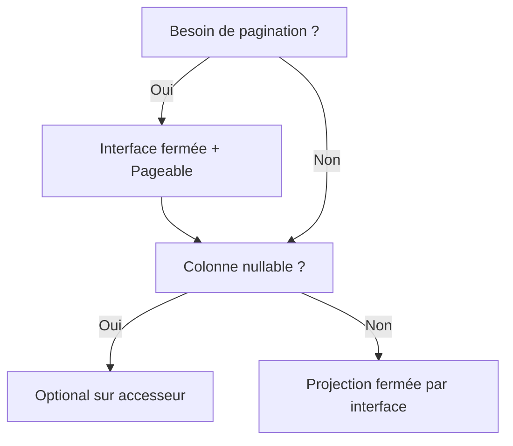
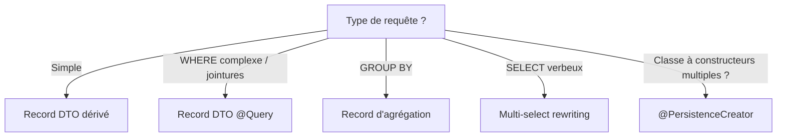
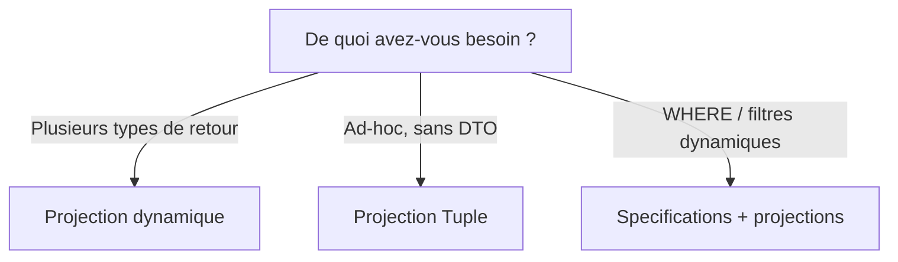
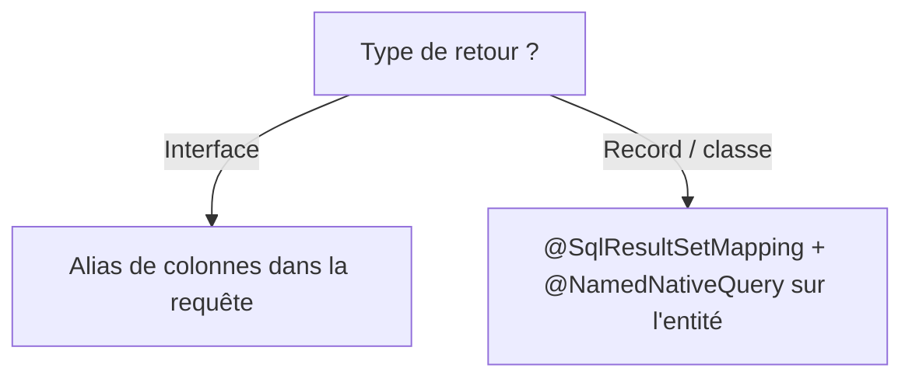
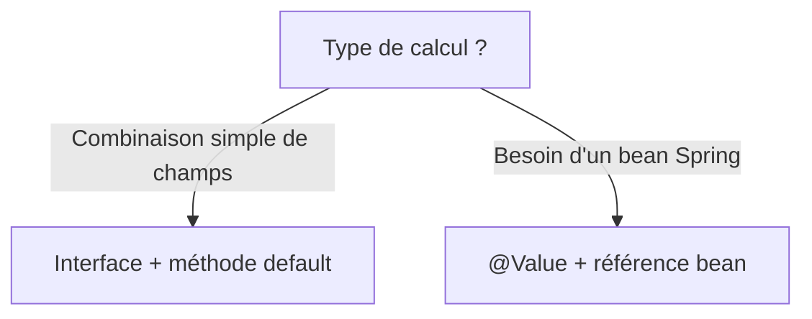
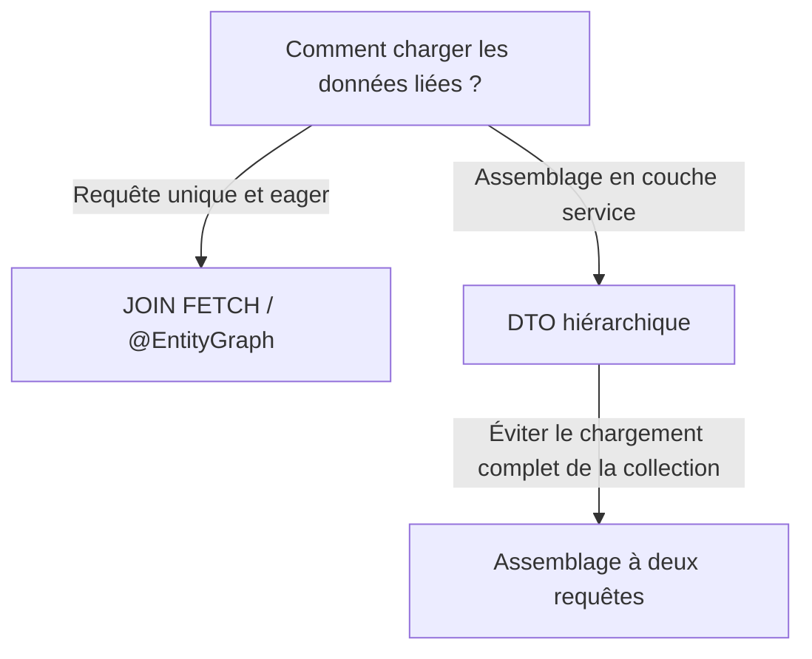

## Le problème

Prenons un endpoint REST qui retourne les titres de films par genre :

```json
GET /api/movies?genre=Sci-Fi
[{"id": 1, "title": "The Matrix"}, {"id": 2, "title": "Inception"}]
```

Voici les entités derrière cet endpoint. `Movie` a un id, un titre, une année de sortie, un genre et une relation many-to-many vers `Actor` via la table de jointure `movies_actors` :

```java
@Entity
@Table(name = "movies")
public class Movie {
    @Id @GeneratedValue(strategy = GenerationType.IDENTITY)
    private Long id;

    @Column(nullable = false)
    private String title;

    @Column(name = "release_year", nullable = false)
    private int releaseYear;

    @Column(nullable = false)
    private String genre;

    @ManyToMany(fetch = FetchType.LAZY)
    @JoinTable(name = "movies_actors",
        joinColumns = @JoinColumn(name = "movie_id"),
        inverseJoinColumns = @JoinColumn(name = "actor_id"))
    private Set<Actor> actors = new HashSet<>();
}
```

```java
@Entity
@Table(name = "actors")
public class Actor {
    @Id @GeneratedValue(strategy = GenerationType.IDENTITY)
    private Long id;

    @Column(name = "first_name", nullable = false)
    private String firstName;

    @Column(name = "last_name", nullable = false)
    private String lastName;

    @ManyToMany(mappedBy = "actors", fetch = FetchType.LAZY)
    private Set<Movie> movies = new HashSet<>();
}
```

Une approche JPA naïve charge l'entité `Movie` complète : les quatre colonnes (id, title, release*year, genre), attachée au contexte de persistence, suivie pour les modifications (\_dirty checking*), avec maintenance des snapshots. Cette surcharge existe alors que les données sont simplement sérialisées en JSON et envoyées sur le réseau.

Avec les collections imbriquées, le problème s'aggrave. Retourner les films avec leurs acteurs sans instructions de chargement explicites déclenche N+1 requêtes : une pour les films, puis une par film pour charger les acteurs depuis la table de jointure.

Les projections résolvent ce problème en limitant le `SELECT` à ce dont l'appelant a besoin.

## Qu'est-ce qu'une projection ?

Une projection limite les colonnes retournées par une requête à ce dont le consommateur a besoin. Au lieu de charger une entité complète, une projection récupère un sous-ensemble de colonnes dans une structure légère en lecture seule.

**Bénéfices** :

- **Moins de données sur le réseau** : un `SELECT` SQL plus étroit signifie moins d'octets de la base vers l'application
- **Pas de surcharge du contexte de persistence** : les projections ne sont pas attachées à l'`EntityManager`, donc pas de dirty checking ni de maintenance de snapshots
- **Contrats explicites** : le type de projection déclare clairement quelles données le consommateur reçoit

Il existe deux catégories :

| Type        | Description                                                          | Optimisation du SELECT                                               |
| ----------- | -------------------------------------------------------------------- | -------------------------------------------------------------------- |
| **Fermée**  | Chaque méthode correspond 1:1 au nom d'une propriété de l'entité     | Spring Data réécrit la requête pour ne sélectionner que ces colonnes |
| **Ouverte** | Utilise des expressions SpEL `@Value` ou casse la correspondance 1:1 | Entité complète chargée, optimisation désactivée                     |

## Projections par interface

### Projection fermée par interface

La forme la plus simple : une interface Java avec des getters correspondant aux noms des propriétés de l'entité.

```java
public interface MovieTitleView {
    Long getId();
    String getTitle();
}
```

```java
List<MovieTitleView> findByGenre(String genre);
```

Spring Data réécrit la requête SQL pour ne sélectionner que `id` et `title` :

```sql
SELECT m.id, m.title FROM movies m WHERE m.genre = ?
```

Le résultat est un proxy dynamique adossé à un `Tuple`. Aucune entité n'est chargée, aucun contexte de persistence n'est impliqué.

**Quand l'utiliser** : listes simples en lecture seule où la réponse est un sous-ensemble plat des colonnes de l'entité. Zéro boilerplate.

### Pagination avec projection fermée par interface

Même interface, ajoutez `Pageable` :

```java
Page<MovieTitleView> findByGenre(String genre, Pageable pageable);
```

Spring Data ajoute `LIMIT ... OFFSET ...` à la requête principale et émet une seconde requête `COUNT` pour le nombre total de pages.

**Quand l'utiliser** : tout endpoint qui sert des listes à une UI. Toujours paginer plutôt que de retourner des collections sans limite.

### Wrappers nullable dans les projections par interface

Les projections par interface supportent les wrappers nullable : si une colonne est nullable en base, l'accesseur peut retourner `Optional<T>` au lieu de `T` :

```java
public interface MovieTitleView {
    Long getId();
    String getTitle();
    Optional<String> getGenre();
}
```

Spring Data enveloppe automatiquement la valeur de la colonne dans un `Optional`, éliminant les vérifications de null dans le code consommateur. Cela fonctionne avec n'importe quel accesseur dans une projection fermée : la requête reste optimisée et le SELECT se réduit aux accesseurs déclarés.

**Quand l'utiliser** : toute colonne nullable où le consommateur devrait gérer explicitement l'absence.



## Projections DTO Record / classe

### Record DTO (requête dérivée)

Les Java Records fonctionnent nativement avec les projections Spring Data :

```java
public record MovieTitleDto(Long id, String title) {}
```

```java
List<MovieTitleDto> findByTitleContaining(String title);
```

Spring Data détecte le constructeur canonique du Record et réécrit la requête :

```sql
SELECT m.id, m.title FROM movies m WHERE m.title LIKE '%' || ? || '%'
```

**Avantages clés par rapport aux projections par interface** :

- **Pas de proxy** : les records sont de simples objets, pas de surcharge de dispatch de méthode
- **Immutabilité** : garantie par le langage
- **Sémantique de valeur** : `equals()`, `hashCode()`, `toString()` auto-générés
- **Adapté à la sérialisation** : Jackson et Spring MVC fonctionnent nativement avec les records

### Record DTO avec `@Query` explicite

Pour les requêtes que les noms de méthodes dérivées ne peuvent pas exprimer (opérateurs de comparaison, jointures) :

```java
@Query("""
        SELECT new com.hogwai.jpaprojections.projection.MovieTitleDto(m.id, m.title)
        FROM Movie m
        WHERE m.releaseYear >= :year
        """)
List<MovieTitleDto> findMoviesReleasedAfter(@Param("year") int year);
```

Spring Data supporte aussi la réécriture automatique : vous pouvez écrire `SELECT m` et il réécrit vers l'expression constructeur à l'exécution.

Si vous utilisez `Page<T>` avec un `@Query` explicite qui retourne une expression constructeur, vous avez généralement besoin d'un paramètre `countQuery` — sinon Spring Data tente de dériver un comptage à partir de l'expression JPQL, ce qui peut produire un SQL incorrect avec `GROUP BY` ou `JOIN FETCH`.

**Quand l'utiliser** : clauses WHERE complexes, jointures entre entités, ou toute requête trop complexe pour les méthodes dérivées.

### Réécriture de requêtes multi-select

Spring Data peut réécrire les requêtes JPQL multi-select en expressions constructeur automatiquement. Au lieu d'écrire une expression `SELECT new` complète, vous listez les propriétés individuelles dans la clause `SELECT` :

```java
@Query("SELECT m.title, m.genre FROM Movie m WHERE m.genre = :genre")
List<MovieTitleGenreDto> findTitleAndGenreByGenre(@Param("genre") String genre);
```

Spring Data détecte que la clause `SELECT` liste des propriétés individuelles et que le type de retour est un DTO, puis réécrit la requête :

```java
SELECT new MovieTitleGenreDto(m.title, m.genre) FROM Movie m WHERE m.genre = ?
```

Les noms des paramètres du constructeur doivent correspondre aux propriétés sélectionnées. Le flag compilateur `-parameters` (activé par Spring Boot) préserve ces noms à l'exécution. Cela fonctionne avec les Records comme avec les DTO basés sur des classes.

**Quand l'utiliser** : requêtes JPQL où écrire une expression constructeur complète alourdit une requête déjà complexe.

### `@PersistenceCreator` pour les DTO à constructeurs multiples

Quand un DTO basé sur une classe (pas un Record) définit plusieurs constructeurs, Spring Data ne peut pas déterminer lequel utiliser pour la projection. La solution est `@PersistenceCreator` :

```java
public class GenreStatDto {
    private final String genre;
    private final long movieCount;

    protected GenreStatDto() {
        this("unknown", 0);
    }

    @PersistenceCreator
    public GenreStatDto(String genre, long movieCount) {
        this.genre = genre;
        this.movieCount = movieCount;
    }

    public String getGenre() { return genre; }
    public long getMovieCount() { return movieCount; }
}
```

Le constructeur sans argument existe pour d'autres frameworks (comme la désérialisation Jackson) qui créent des instances via réflexion avec un constructeur sans argument. L'annotation `@PersistenceCreator` sur le constructeur paramétré indique à Spring Data : _ce_ constructeur doit être utilisé pour la projection.

Les Records évitent ce problème entièrement : ils ont un seul constructeur canonique par définition, donc aucune ambiguïté.

**Quand l'utiliser** : codebase legacy avec des DTO POJO existants, ou quand vous avez besoin à la fois d'un constructeur sans argument et d'un constructeur de projection.

### Agrégation avec `GROUP BY`

Les Records fonctionnent naturellement avec les requêtes d'agrégation :

```java
public record GenreStat(String genre, long movieCount) {}
```

```java
@Query("""
        SELECT new com.hogwai.jpaprojections.projection.GenreStat(m.genre, COUNT(m))
        FROM Movie m
        GROUP BY m.genre
        ORDER BY COUNT(m) DESC
        """)
List<GenreStat> countByGenre();
```

```sql
SELECT m.genre, COUNT(m.id) FROM movies m GROUP BY m.genre ORDER BY COUNT(m.id) DESC
```

**Quand l'utiliser** : rapports, tableaux de bord, endpoints d'agrégation.



## Projections dynamiques et à l'exécution

### Projection dynamique

Une seule méthode de repository sert plusieurs consommateurs :

```java
<T> List<T> findByGenre(String genre, Class<T> type);
```

```java
List<MovieTitleView> views = repo.findByGenre("Sci-Fi", MovieTitleView.class);
List<MovieTitleDto>  dtos  = repo.findByGenre("Sci-Fi", MovieTitleDto.class);
List<Movie>          movies = repo.findByGenre("Sci-Fi", Movie.class);
```

Le paramètre `Class<T>` est routé vers la même logique d'optimisation que les types de retour statiques, mais la décision est déferrée à l'exécution.

**Limite** : la sûreté à la compilation est limitée, n'importe quelle `Class` peut être passée.

**Quand l'utiliser** : la même requête doit servir plusieurs consommateurs avec des besoins de données différents.

### Projection Tuple

La forme la plus brute, aucun DTO nécessaire :

```java
@Query("""
        SELECT m.id AS id, m.title AS title,
               m.releaseYear AS releaseYear, m.genre AS genre
        FROM Movie m WHERE m.genre = :genre
        """)
List<Tuple> findTupleByGenre(@Param("genre") String genre);
```

```java
for (Tuple t : results) {
    Long id = t.get("id", Long.class);
    String title = t.get("title", String.class);
}
```

`jakarta.persistence.Tuple` fournit un accès typé par nom ou position. C'est le même mécanisme que Spring Data utilise en interne pour les projections par interface.

**Quand l'utiliser** : requêtes ad-hoc, sélection dynamique de colonnes, ou prototypage avant de définir un type de projection dédié.

### Specifications + projections (API fluent)

Pour des prédicats WHERE dynamiques à l'exécution :

```java
public class MovieSpecifications {
    public static Specification<Movie> genreEquals(String genre) {
        return (root, query, cb) -> cb.equal(root.get("genre"), genre);
    }
    public static Specification<Movie> releaseYearGreaterOrEqual(int year) {
        return (root, query, cb) -> cb.greaterThanOrEqualTo(root.get("releaseYear"), year);
    }
}
```

```java
Specification<Movie> spec = MovieSpecifications.genreEquals("Sci-Fi")
        .and(MovieSpecifications.releaseYearGreaterOrEqual(2000));

List<MovieTitleDto> results = movieRepository
        .findBy(spec, q -> q.as(MovieTitleDto.class).all());
```

**Limite** : le rétrécissement de colonnes via `.as(Projection.class)` est limité comparé aux projections par requêtes dérivées. Le mécanisme sous-jacent charge l'entité puis la convertit en projection, donc vous avez toujours le SELECT complet de l'entité. Utilisez cette approche pour la dynamique des prédicats, pas pour l'optimisation des colonnes.

**Quand l'utiliser** : endpoints de recherche avec filtres dynamiques, panneaux d'administration, ou toute requête dont les critères de filtrage ne sont pas connus à la compilation.



## Projections SQL natives

### Requête native + projection par interface (alias de colonnes)

```java
@Query(value = "SELECT m.id AS id, m.title AS title FROM movies m WHERE m.genre = ?1",
       nativeQuery = true)
List<MovieTitleView> findByGenreNative(String genre);
```

Les alias de colonnes doivent correspondre aux noms des propriétés Java (camelCase). Spring Data crée des proxies d'interface à partir du résultat natif.

**Quand l'utiliser** : fonctionnalités SQL spécifiques à une base de données (window functions, CTEs, `ILIKE`, `FOR UPDATE`) tout en bénéficiant des projections.

### Requête native + Record DTO (`@SqlResultSetMapping`)

Les requêtes natives avec des DTO basés sur des classes nécessitent un `@SqlResultSetMapping` :

```java
@SqlResultSetMapping(
    name = "MovieTitleDtoMapping",
    classes = @ConstructorResult(
        targetClass = MovieTitleDto.class,
        columns = {
            @ColumnResult(name = "id", type = Long.class),
            @ColumnResult(name = "title")
        }
    )
)
@NamedNativeQuery(
    name = "Movie.findByGenreNativeDto",
    query = "SELECT m.id, m.title FROM movies m WHERE m.genre = ?1",
    resultSetMapping = "MovieTitleDtoMapping"
)
@Entity
public class Movie { ... }
```

```java
@Query(name = "Movie.findByGenreNativeDto", nativeQuery = true)
List<MovieTitleDto> findByGenreNativeDto(String genre);
```

Sans ce mapping, les requêtes natives retournant des DTO basés sur des classes produisent une `ConverterNotFoundException`.

| Aspect                   | JPQL (`@Query`)                     | SQL natif                           |
| ------------------------ | ----------------------------------- | ----------------------------------- |
| Projection par interface | Les alias correspondent aux getters | Alias de colonnes explicites requis |
| DTO classe/Record        | Auto ou `SELECT new`                | `@SqlResultSetMapping` requis       |
| Portabilité              | Indépendant de la base              | Spécifique à une base               |



## Champs calculés dans les projections

### Interface + méthode par défaut (au lieu de `@Value` SpEL)

```java
public interface ActorNameView {
    Long getId();
    String getFirstName();
    String getLastName();

    default String getFullName() {
        return getFirstName() + " " + getLastName();
    }
}
```

Pourquoi c'est important : utiliser `@Value("#{target.firstName + ' ' + target.lastName}")` rend la projection _ouverte_. Spring Data ne peut pas optimiser le SELECT car l'expression SpEL pourrait référencer n'importe quelle propriété, donc l'entité complète est chargée.

Une méthode `default` maintient la projection _fermée_ : tous les accesseurs correspondent encore directement aux propriétés de l'entité, donc Spring Data optimise le SELECT. Le calcul a lieu en Java sur le sous-ensemble déjà chargé.

| Approche          | Optimisation du SELECT        | Boilerplate |
| ----------------- | ----------------------------- | ----------- |
| `@Value` SpEL     | Entité complète chargée       | Minimal     |
| Méthode `default` | Réduit aux colonnes utilisées | Minimal     |

Utilisez `@Value` seulement quand vous devez référencer un bean Spring (`@Value("#{@myBean.getFullName(target)}")`) ou un argument de méthode de requête.

### `@Value` avec référence à un bean

Quand vous devez appeler un bean Spring depuis une projection (par exemple, pour combiner une propriété avec du texte traduisible ou une logique métier), l'annotation `@Value` avec une référence SpEL est l'outil approprié :

```java
@Component("projectionHelper")
public class ProjectionHelper {
    public String formatGenreLabel(Movie movie) {
        return movie.getTitle() + " [" + movie.getGenre() + "]";
    }
}
```

```java
public interface MovieWithLabelView {
    String getTitle();

    @Value("#{@projectionHelper.formatGenreLabel(target)}")
    String getGenreLabel();
}
```

`#target` fait référence à l'instance d'entité sous-jacente. Parce que `@Value` brise la correspondance 1:1 avec les propriétés, il s'agit d'une projection _ouverte_ : Spring Data charge l'entité complète avant d'évaluer l'expression SpEL :

```sql
SELECT m.id, m.title, m.release_year, m.genre FROM movies m WHERE m.genre = ?
```

Toutes les colonnes de l'entité sont sélectionnées même si seule `title` est utilisée individuellement par la projection.

**Quand l'utiliser** : seulement quand une méthode `default` ne peut pas fournir la logique : spécifiquement quand vous avez besoin d'accéder à un bean Spring. Pour les champs calculés simples, une méthode `default` maintient la projection fermée.



## Collections imbriquées

### Projections d'interface imbriquées

Retourner les films avec leurs acteurs nécessite un traitement particulier. Trois approches :

#### JOIN FETCH

```java
public interface MovieWithActorsView {
    Long getId();
    String getTitle();
    int getReleaseYear();
    Set<ActorView> getActors();

    interface ActorView {
        Long getId();
        String getFirstName();
        String getLastName();
    }
}
```

```java
@Query("SELECT m FROM Movie m JOIN FETCH m.actors WHERE m.genre = :genre")
List<MovieWithActorsView> findByGenreWithActors(@Param("genre") String genre);
```

`JOIN FETCH` force Hibernate à charger la collection d'acteurs dans la même requête SQL :

```sql
SELECT m1_0.id, a1_0.movie_id, a1_1.id, a1_1.first_name, a1_1.last_name,
       m1_0.genre, m1_0.release_year, m1_0.title
FROM movies m1_0
JOIN movies_actors a1_0 ON m1_0.id = a1_0.movie_id
JOIN actors a1_1 ON a1_1.id = a1_0.actor_id
WHERE m1_0.genre = ?
```

Limitation : avec `@Query("SELECT m ...")` l'entité `Movie` complète est sélectionnée ; le rétrécissement de colonnes ne s'applique pas sur l'entité racine. Les colonnes imbriquées `ActorView` sont aussi sélectionnées complètement.

#### @EntityGraph

```java
@NamedEntityGraph(
    name = "Movie.withActors",
    attributeNodes = @NamedAttributeNode("actors")
)
@Entity
public class Movie { ... }
```

```java
@EntityGraph("Movie.withActors")
List<MovieWithActorsView> findByGenreIgnoreCase(String genre);
```

`@EntityGraph` est une alternative déclarative à `JOIN FETCH`. Le graphe d'entité nommé est défini une fois et réutilisé entre les méthodes de requête. Il fonctionne avec les requêtes dérivées (pas besoin de `@Query`).

| Approche       | Avantages                                             | Inconvénients                       |
| -------------- | ----------------------------------------------------- | ----------------------------------- |
| `JOIN FETCH`   | Explicite dans la requête, pas de couplage à l'entité | Lié à une seule chaîne de requête   |
| `@EntityGraph` | Réutilisable, fonctionne avec les requêtes dérivées   | Déclaré sur l'entité, moins visible |

`JOIN FETCH` produit un INNER JOIN ; `@EntityGraph` produit un LEFT JOIN. Pour des clés étrangères non-null (le cas courant), le résultat est identique. Choisissez `@EntityGraph` quand la même stratégie de chargement s'applique à plusieurs requêtes.

#### Démonstration N+1 (non sûre)

```java
@Query("SELECT m FROM Movie m WHERE m.genre = :genre")
List<MovieWithActorsView> findByGenreWithActorsNPlusOne(@Param("genre") String genre);
```

Cette version omet délibérément le fetch. Quand vous accédez à `getActors()` sur chaque résultat, Hibernate émet une requête de chargement paresseux par film. Avec 3 films Sci-Fi : **1 + 3 = 4 requêtes** au lieu d'une.

Sûr (JOIN FETCH) : 1 requête
Non sûr (sans fetch) : 1 + N requêtes

### DTO hiérarchique (assemblage en service)

Les expressions constructeur JPQL ne peuvent pas produire directement des DTO avec collections imbriquées. La solution est l'assemblage au niveau service :

```java
public record MovieDetailDto(
    Long id, String title, int releaseYear, String genre,
    List<ActorDto> actors
) {
    public record ActorDto(Long id, String firstName, String lastName) {}
}
```

```java
@Transactional(readOnly = true)
public MovieDetailDto getMovieDetail(Long movieId) {
    Movie movie = movieRepository.findById(movieId).orElse(null);
    if (movie == null) return null;

    List<ActorDto> actorDtos = movie.getActors().stream()
            .map(a -> new ActorDto(a.getId(), a.getFirstName(), a.getLastName()))
            .toList();

    return new MovieDetailDto(
            movie.getId(), movie.getTitle(), movie.getReleaseYear(),
            movie.getGenre(), actorDtos);
}
```

`@Transactional(readOnly = true)` maintient les associations LAZY disponibles pour le mapping.

#### Alternative à deux requêtes

Quand vous voulez éviter le N+1 qui résulterait du chargement paresseux de la collection d'acteurs sur chaque entité :

```java
public ActorWithMoviesDto getActorWithMovies(Long actorId) {
    var actor = actorRepository.findById(actorId).orElse(null);
    if (actor == null) return null;

    List<MovieTitleDto> movies = actorRepository.findMoviesByActorId(actorId);
    return new ActorWithMoviesDto(
            actor.getId(), actor.getFirstName(), actor.getLastName(),
            movies);
}
```

Deux requêtes indépendantes : la première charge l'entité `Actor` complète (incontournable pour la racine), la seconde récupère la collection de films sous forme de projection légère. L'avantage clé est d'éviter le chargement complet de l'entité pour le côté _collection_.



## Comment Spring Data optimise les projections

Spring Data utilise deux stratégies selon le type de projection :

1. **Projections par interface** : Spring Data génère un proxy dynamique adossé à un `Tuple`. La requête est réécrite à l'exécution : seules les colonnes correspondant aux méthodes d'accès de l'interface sont incluses dans la clause `SELECT`. Cela fonctionne parce que l'interface est _fermée_ : chaque méthode correspond à une propriété connue de l'entité.

2. **Projections Record/Classe** : Spring Data inspecte les noms des paramètres du constructeur canonique et les fait correspondre aux propriétés de l'entité. Pour les requêtes dérivées, la requête est automatiquement réécrite en une expression constructeur JPQL `SELECT new ...`. Pour les `@Query` explicites retournant un DTO basé sur une classe, la même réécriture s'applique quand le JPQL sélectionne l'entité racine.

Le flag compilateur `-parameters` est nécessaire pour les DTO basés sur des classes afin de préserver les noms des paramètres du constructeur. Pour les Records, c'est moins critique car la JVM préserve les noms des composants via `Class.getRecordComponents()`. Spring Boot active ce flag par défaut dans son POM parent.

## Anti-patrons à éviter

| Anti-patron                                           | Pourquoi                                                                           | À la place                                              |
| ----------------------------------------------------- | ---------------------------------------------------------------------------------- | ------------------------------------------------------- |
| `@Value("#{target.x + target.y}")`                    | Projection ouverte : désactive l'optimisation du SELECT                            | Méthode `default` sur l'interface                       |
| Interface imbriquée sans `JOIN FETCH`                 | Requêtes N+1 pour chaque entité racine                                             | `@Query` avec `JOIN FETCH` ou `@EntityGraph`            |
| Projection par interface pour des batchs              | Proxy indirect, surcharge d'allocation due aux proxys, pas de sémantique de valeur | Record DTO avec expression constructeur                 |
| SQL natif pour des requêtes JPQL simples              | Perd la réécriture de requête et la portabilité                                    | JPQL `@Query`                                           |
| Chargement d'entité complète pour 1-2 champs          | Surcharge du contexte de persistence, plus de données sur le réseau                | Projection par interface fermée ou Record               |
| Type brut sur accesseur nullable                      | Colonne nullable retourne `null`, oblige à vérifier partout                        | `Optional<T>` comme type de retour                      |
| Paramètre constructeur primitif pour colonne nullable | NULL en base mappé sur `long`/`int` primitif provoque une NPE à la construction    | Type boxé `Long`/`Integer` à la place                   |
| DTO avec plusieurs constructeurs                      | Spring Data ne peut pas déterminer lequel utiliser                                 | `@PersistenceCreator` sur le constructeur de projection |
| Assemblage par entité complète dans une boucle        | N+1 sur les collections LAZY dans `findAll()` + stream                             | Batch fetch ou assemblage à deux requêtes               |

## Résumé des types de projection

| #   | Type                          | Type retour                      | Requête                | Cas d'usage                          |
| --- | ----------------------------- | -------------------------------- | ---------------------- | ------------------------------------ |
| 1   | Interface fermée              | `MovieTitleView`                 | Dérivée (optimisée)    | Vue plate en lecture seule           |
| 2   | Interface fermée + pagination | `Page<MovieTitleView>`           | Dérivée + `Pageable`   | Listes paginées                      |
| 3   | Wrappers nullable             | `MovieTitleView` + `Optional<?>` | Dérivée (optimisée)    | Accesseurs null-safe                 |
| 4   | Interface + JOIN FETCH        | `MovieWithActorsView`            | `@Query`               | Entités imbriquées                   |
| 5   | Interface + @EntityGraph      | `MovieWithActorsView`            | Dérivée + annotation   | Stratégie de chargement réutilisable |
| 6   | Démo N+1                      | `MovieWithActorsView`            | Sans fetch             | Observer le comportement N+1         |
| 7   | Interface + méthode default   | `ActorNameView`                  | Dérivée (optimisée)    | Champs dérivés, sans SpEL            |
| 8   | Record DTO (dérivé)           | `MovieTitleDto`                  | Dérivée (réécrite)     | DTO simple                           |
| 9   | Record DTO (@Query)           | `MovieTitleDto`                  | Constructeur JPQL      | WHERE complexes/jointures            |
| 10  | Réécriture multi-select       | `MovieTitleGenreDto`             | JPQL multi-select      | Requêtes concises                    |
| 11  | `@PersistenceCreator`         | `GenreStatDto`                   | Constructeur JPQL      | DTO à constructeurs multiples        |
| 12  | Record d'agrégation           | `GenreStat`                      | JPQL `GROUP BY`        | Rapports, statistiques               |
| 13  | Dynamique                     | `<T>`                            | Dispatch à l'exécution | Plusieurs consommateurs              |
| 14  | Natif + interface             | `MovieTitleView`                 | SQL natif + alias      | Fonctionnalités spécifiques DB       |
| 15  | Natif + DTO                   | `MovieTitleDto`                  | `@SqlResultSetMapping` | SQL natif + DTO                      |
| 16  | Tuple                         | `Tuple`                          | JPQL avec alias        | Ad-hoc, sans DTO                     |
| 17  | Specifications                | DTO via `findBy`                 | Fluent + spec          | Prédicats dynamiques                 |
| 18  | `@Value` + référence bean     | `MovieWithLabelView`             | `@Query` (ouverte)     | Accès à un bean Spring               |
| 19  | Hiérarchique (service)        | `MovieDetailDto`                 | Entité -> DTO          | Collections imbriquées               |

## Pour conclure

Les projections Spring Data JPA couvrent un large spectre : d'une interface de 3 lignes qui réduit le `SELECT` SQL, à l'assemblage au niveau service pour des réponses profondément imbriquées, en passant par les requêtes natives pour des fonctionnalités spécifiques à une base de données.

Les points clés à retenir :

- **Les projections fermées** (interface ou Record) sont le choix par défaut pour les données plates. Elles offrent l'optimisation du SELECT sans aucun coût.
- **Les méthodes default** maintiennent la projection fermée quand vous avez besoin de champs calculés. Évitez `@Value` SpEL sauf si vous avez besoin d'accéder à un bean Spring.
- **Les wrappers nullable** (`Optional<T>` sur les accesseurs d'interface) rendent les projections null-safe sans code supplémentaire.
- **Le JPQL multi-select** permet à Spring Data de réécrire `SELECT m.col1, m.col2` en expressions constructeur automatiquement.
- **`@PersistenceCreator`** lève l'ambiguïté quand un DTO a plusieurs constructeurs. Les Records évitent ce problème entièrement.
- **Les collections imbriquées** nécessitent un `JOIN FETCH` ou `@EntityGraph` explicite. Sans eux, vous obtenez des requêtes N+1.
- **Les Records** sont supérieurs aux interfaces pour les DTO : pas de proxy, immutables, sémantique de valeur, compatibles Jackson.
- **Les projections dynamiques** et **Specifications** échangent une partie de la sûreté à la compilation et de l'optimisation des colonnes contre de la flexibilité à l'exécution. Utilisez-les quand la forme de la requête n'est pas connue à l'avance.
- **L'assemblage en service** est la seule façon de produire des DTO avec collections imbriquées, mais vous pouvez choisir entre le chargement d'une seule entité (avec `@Transactional`) et l'assemblage à deux requêtes.

Le code source complet de cet article est disponible sur
[jpa-projections](https://github.com/Hogwai/hogwai.github.io-content/tree/main/jpa-projections).
