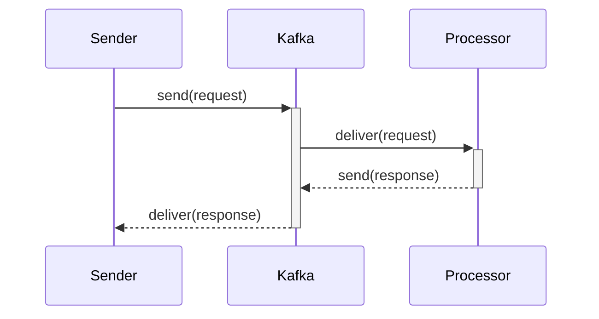
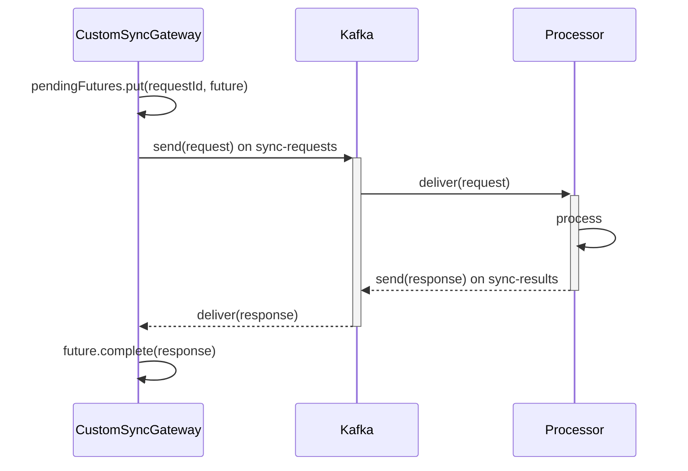
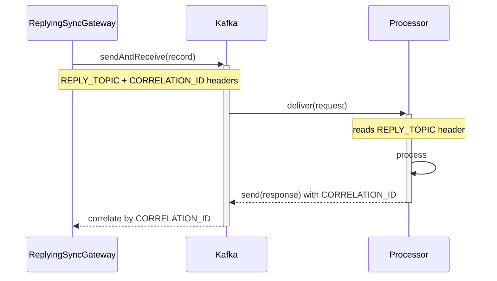

## Contexte

Kafka est fondamentalement asynchrone. Les producteurs publient des messages dans des topics, les consommateurs les lisent à leur rythme, et personne n'attend personne.

Dans la réalité, on rencontre pourtant des workflows qui dérogent à ce modèle. Imaginons un service qui reçoit une requête REST de traitement de document, la transmet à un worker distant via Kafka, et doit bloquer en attendant le résultat. Ou un moteur d'orchestration où une étape en déclenche une autre et attend une confirmation avant de continuer. Ou encore une intégration avec un système legacy dont le code appelant s'attend à une API de type RPC bloquante.

Kafka ne fournit pas ça nativement mais spring-kafka si, avec le `ReplyingKafkaTemplate`. Avant d'y venir, regardons ce qu'il faudrait construire à la main.

## Le problème

Une requête/réponse synchrone doit satisfaire trois contraintes que le modèle pub/sub de Kafka ne résout pas directement :

- Corrélation : quand plusieurs requêtes sont en vol, il faut associer chaque réponse à la bonne requête. Un consommateur Kafka lit un topic séquentiellement. Celui qui reçoit les réponses voit tout défiler et doit déterminer à quelle requête chaque message correspond.

- Timeout : l'appelant s'attend à une réponse dans un délai raisonnable. Si le service distant est lent ou injoignable, il ne doit pas rester bloqué indéfiniment.

- Concurrence : si dix appelants envoient une requête en même temps, les résultats ne doivent pas se mélanger, et une réponse lente ne doit pas en bloquer d'autres.

## Architecture générale

Le tout repose sur deux acteurs : un émetteur qui initie la requête, et un processeur qui la traite et renvoie une réponse. Les deux communiquent via des topics Kafka.

On a besoin des topics suivants :

- Un topic de requête pour acheminer les messages de l'émetteur vers le processeur
- Un topic de réponse (ou deux, selon l'approche) pour le retour
- Un topic de dead letter optionnel pour les requêtes en échec

Le flux général ressemble à ceci :



## Le modèle partagé

Les deux services partagent deux records simples :

```java
public record Request(
    String requestId,
    String payload,
    Instant timestamp
) {
    public Request(String payload) {
        this(UUID.randomUUID().toString(), payload, Instant.now());
    }
}

public record Response(
    String requestId,
    String payload,
    String status,
    long processingTimeMs
) {}
```

Le `requestId` est un UUID généré par l'émetteur. C'est lui qui fait le lien entre requête et réponse, dans les deux approches.

## Le processeur

Le processeur supporte les deux patterns sans distinction. Il écoute sur `sync-requests` et regarde l'en-tête `REPLY_TOPIC` pour décider où envoyer la réponse :

```java
@KafkaListener(
    topics = "${app.kafka.topic.requests}",
    groupId = "request-processor",
    containerFactory = "kafkaListenerContainerFactory"
)
public void onRequest(ConsumerRecord<String, Request> record) {
    Request request = record.value();

    try {
        // business logic
        Response response = new Response(
            request.requestId(),
            "Processed: " + request.payload(),
            "SUCCESS",
            100L
        );
        sendResponse(record, response);
    } catch (Exception e) {
        // Envoi vers DLQ pour ne pas perdre le message
        kafkaTemplate.send(dlqTopic, request.requestId(), request);

        // Envoi d'une réponse d'échec pour que l'émetteur ne timeout pas
        Response errorResponse = new Response(
            request.requestId(),
            e.getMessage(),
            "FAILURE",
            0L
        );
        sendResponse(record, errorResponse);
    }
}

private void sendResponse(ConsumerRecord<String, Request> record, Response response) {
    Header replyTopicHeader = record.headers().lastHeader(KafkaHeaders.REPLY_TOPIC);

    if (replyTopicHeader != null) {
        // Flux ReplyingKafkaTemplate, utiliser le topic de l'en-tête
        String replyTopic = new String(replyTopicHeader.value(), StandardCharsets.UTF_8);
        var reply = new ProducerRecord<>(replyTopic, response.requestId(), response);

        Header correlationId = record.headers().lastHeader(KafkaHeaders.CORRELATION_ID);
        if (correlationId != null) {
            reply.headers().add(correlationId);
        }
        kafkaTemplate.send(reply);
    } else {
        // Approche personnalisée, utiliser le topic de résultats fixe
        kafkaTemplate.send(resultsTopic, response.requestId(), response);
    }
}
```

Le point clé, c'est l'en-tête `REPLY_TOPIC`. Quand la requête a été envoyée via `ReplyingKafkaTemplate`, le template ajoute automatiquement cet en-tête (ainsi qu'un `CORRELATION_ID`). Avec l'approche personnalisée, ces en-têtes n'existent pas, donc le processeur utilise le topic fixe `sync-results`.

En cas d'erreur, le processeur envoie la requête originale vers une DLQ (pour ne pas la perdre) et retourne immédiatement une réponse `FAILURE`. Comme ça l'émetteur ne se retrouve pas à attendre un timeout sans savoir ce qui s'est passé.

## Approche 1 : personnalisée avec CompletableFuture

La première approche construit la corrélation à la main. Une `ConcurrentHashMap` stocke des `CompletableFuture` indexés par `requestId`. Un `@KafkaListener` dédié reçoit les réponses et complète le future correspondant.

```java
@Service
public class CustomSyncGateway {

    private final Map<String, CompletableFuture<Response>> pendingFutures = new ConcurrentHashMap<>();
    private final KafkaTemplate<String, Request> kafkaTemplate;

    public Response sendSync(Request request)
            throws InterruptedException, ExecutionException, TimeoutException {

        var future = new CompletableFuture<Response>();
        pendingFutures.put(request.requestId(), future);

        kafkaTemplate.send(new ProducerRecord<>(requestTopic, request.requestId(), request));

        try {
            return future.get(syncTimeout, TimeUnit.SECONDS);
        } catch (TimeoutException e) {
            pendingFutures.remove(request.requestId());
            throw e;
        }
    }

    public void complete(Response response) {
        var future = pendingFutures.remove(response.requestId());
        if (future != null) {
            future.complete(response);
        }
    }
}
```

Flux :



Le listener de réponses résout les futures :

```java
@Component
public class CustomReplyListener {

    private final CustomSyncGateway gateway;

    @KafkaListener(
        topics = "${app.kafka.topic.results}",
        groupId = "sync-sender-custom",
        containerFactory = "kafkaListenerContainerFactory"
    )
    public void onResponse(ConsumerRecord<String, Response> record) {
        gateway.complete(record.value());
    }
}
```

Ce que vous devez gérer vous-même :

- La `ConcurrentHashMap` qui contient les futures en attente
- La création du `CompletableFuture` avant chaque envoi
- Son nettoyage en cas de timeout (pour éviter les fuites mémoire)
- Un `@KafkaListener` dédié pour écouter les réponses
- L'appel à `future.complete(response)` quand la réponse arrive

Avantages : contrôle total. Le service distant n'a pas besoin de connaître les en-têtes Kafka ni les mécanismes de corrélation de Spring. Il lui suffit d'envoyer une réponse sur un topic connu. N'importe quel format de topic de réponse fonctionne.

Inconvénients : beaucoup de code à écrire. Le cycle de vie manuel est source d'erreurs : un nettoyage oublié après un timeout laisse des futures en mémoire, une race condition dans l'accès à la map peut faire perdre des réponses.

## Approche 2 : ReplyingKafkaTemplate de Spring Kafka

La seconde approche utilise le `ReplyingKafkaTemplate` fourni par Spring Kafka, qui gère la corrélation au niveau protocole via des en-têtes Kafka.

```java
@Service
public class ReplyingSyncGateway {

    private final ReplyingKafkaTemplate<String, Request, Response> replyingTemplate;

    public Response sendSync(Request request)
            throws InterruptedException, ExecutionException, TimeoutException {

        var record = new ProducerRecord<>(requestTopic, request.requestId(), request);

        RequestReplyFuture<String, Request, Response> future =
                replyingTemplate.sendAndReceive(record, Duration.ofSeconds(syncTimeout));

        var responseRecord = future.get(syncTimeout, TimeUnit.SECONDS);
        return responseRecord.value();
    }
}
```

Flux :



Ce qui est fait automatiquement :

- Les en-têtes `REPLY_TOPIC` et `CORRELATION_ID` sont positionnés sur le message sortant
- Un consommateur de réponses s'abonne au topic de réponse
- Les réponses sont corrélées via l'en-tête `CORRELATION_ID` et associées au bon future
- Pas de `ConcurrentHashMap`, pas de `@KafkaListener` personnalisé, pas de nettoyage manuel

Avantages : beaucoup moins de code. La corrélation par en-têtes est robuste, tant que le service distant copie bien l'en-tête `CORRELATION_ID` dans sa réponse. Le nettoyage des timeouts est automatique.

Inconvénients : le service distant doit honorer les en-têtes `REPLY_TOPIC` et `CORRELATION_ID`. Si vous appelez un service tiers qui ne peut pas manipuler d'en-têtes arbitraires, cette approche ne marche pas. Le topic de réponse est aussi déterminé par l'émetteur, vous devez le configurer au moment de créer le bean `ReplyingKafkaTemplate`.

## Comparaison

| Critère                    | Approche manuelle                | ReplyingKafkaTemplate             |
| -------------------------- | -------------------------------- | --------------------------------- |
| Corrélation                | `requestId` dans le message      | En-tête `CORRELATION_ID`          |
| Stockage des futures       | `ConcurrentHashMap`              | Interne au template               |
| Écoute des réponses        | `@KafkaListener` écrit à la main | Automatique                       |
| Nettoyage après timeout    | Manuel (bloc `finally`)          | Automatique                       |
| Code à écrire              | Modéré                           | Minimal                           |
| Contrôle sur le routage    | Total                            | Limitée par la config du template |
| Contrainte service distant | Aucune, topic fixe connu         | Doit recopier les en-têtes Kafka  |

## Quand utiliser quoi

Préférez l'approche personnalisée quand :

- Le service distant n'est pas sous votre contrôle et ne peut pas manipuler d'en-têtes spécifiques
- Vous avez besoin d'un contrôle total sur le routage du topic de réponse
- Vous intégrez un système legacy qui attend un topic de réponse fixe

Préférez ReplyingKafkaTemplate quand :

- L'émetteur et le processeur sont des services Spring Boot dont vous maîtrisez le code
- Vous voulez moins de code et une gestion native par le framework
- La corrélation par en-têtes vous semble plus robuste que des identifiants noyés dans le message

## Mise en garde

Ces patterns contournent les principes conceptuelle de Kafka. Kafka est fait pour de la messagerie asynchrone de type fire-and-forget, à grande échelle. Chaque appel synchrone requête/réponse maintient un thread en attente. Avec des centaines ou des milliers de requêtes concurrentes, on peut se retrouver avec des threads bloqués sur des futures.
Résultat : famine CPU, épuisement du pool de threads, et un cluster Kafka quipasse son temps à gérer du transit.

Il faut donc utiliser ces patterns avec parcimonie, uniquement là où la logique métier exige vraiment un échange synchrone. Dans la plupart des cas, une architecture "event-driven" est plus adaptée.

## Conclusion

Le choix entre l'approche manuelle avec `CompletableFuture` et l'approche native avec `ReplyingKafkaTemplate` dépend du besoin de contrôle d'un côté, et de l'envie d'éviter le code passe-partout de l'autre. Connaître les deux vous permet de faire le bon compromis pour votre contexte.

Un projet complet qui implémente les deux approches est disponible ici :
[kafka-synchronous-messaging](https://github.com/Hogwai/hogwai.github.io-content/tree/main/kafka-synchronous-messaging)
